# Sanda Bazaar
*A Treasure Trove on Gotland*

)
<hr>

<h3 align="center">Full-Stack Project- E-Commerce(HTML5, CSS3, Bootstrap, Django, Python, JavaScript, jQuery, PostgreSQL, AWS, Heroku)
</h3>

**TABLE OF CONTENTS**

  - [Overview](#overview)
  - [UX](#ux)
    - [Scope](#scope)
    - [Structure](#structure)
    - [Surface](#surface)
  - [Business Model](#business-model)
  - [Marketing](#marketing)
  - [Agile Methodology](#agile-methodology)
  - [Features](#features)
  - [Database](#database)
  - [Responsive Layout and Design](#responsive-layout-and-design)
  - [Technologies Used](#technologies-used)
  - [Setup and Installation](#setup-and-installation)
  - [Testing](#testing)
  - [Deployment](#deployment)
  - [Credits](#credits)

## Overview
Sanda Bazaar is an e-commerce platform that merges the distinctive charm of Gotland's culture with the convenience of online shopping. Our mission is to streamline the buying process for a wide array of culturally rich products. Customers have the ability to delve into product details, curate wishlists, place items into their shopping carts, and complete transactions through secure online payments. The site additionally facilitates order history tracking for enhanced user convenience.

Developed with a robust tech stack comprising Python, Django, HTML, CSS, and JavaScript, Sanda Bazaar provides a seamless and engaging user experience. The platform's performance is anchored by a PostgreSQL database, ensuring reliability and efficiency in data management.

A unique feature of Sanda Bazaar is our summer shop. Nestled in the heart of Gotland, the summer shop offers a tranquil retreat for visitors. Here, they can enjoy a cup of coffee, indulge in light refreshments, and experience the local ambiance. The summer shop serves as a physical extension of our digital marketplace, allowing customers to immerse themselves in the tangible essence of Gotland's culture. It's a place where online shopping meets real-world experience, creating a complete and enriching journey into the world of diverse cultures.

Experience the essence of Gotland at Sanda Bazaar, where every purchase, whether online or at our summer shop, is a journey into a world of diverse cultures and unique experiences.
<br><br>
The fully deployed project can be accessed at [this link](https://thebazaar-30d8729d015c.herokuapp.com/).<br><br>

## UX

### Viewing and Navigation EPIC

- As a user, I want to understand the purpose of the website from the first interaction with the content.
- As a user, I want to be able to easily use the site functionalities on all viewports, so I can shop the products from any device.
- As a user, I want to see a footer with relevant information and documents.
- As a user, I want to be able to access a navigation menu at any time, so I can easily navigate through the website content.
- As a user, I want to be able search through site products by entering a key word.

### User Registration/Authentication EPIC

- As a user, I want to be able to register on the website.
- As a user, I want to be able to confirm my account with an email.
- As a user/admin, I want to be able to authenticate using only email and password.
- As a user, I want to be able to reset my password in case I forgot it.
- As a user/admin, I want to be able to log out at any time.

### Products EPIC

- As a user, I want to see a catalog with all the products and also grouped by categories.
- As a user, I want to be able to apply filters and to sort the listed products, so I can easily find the ones I am interested to buy.
- As a user, I want to see a page with full specifications for every product, so I can easily decide which one I would want to buy.
- As a user, I want to be able to add any product to the shopping bag in a selected quantity.
- As an admin, I want to be able to edit product details.
- As an admin, I want to be able to delete products from the catalog.
- As an admin, I want to be able to add new products to catalog.

### Reviews EPIC

- As a user, I want to be able to see all the reviews added for any product, so I can easily make an opinion about its quality.
- As a logged in user, I want to be able to add a review for any product I have purchased.
- As a user, I want to be able to see a general rating of every product.

### Wishlist EPIC

- As a logged-in user, I want to be able to add/remove any product from the Wishlist.
- As a logged-in user, I want to see all the products added to Wishlist.

### Bag EPIC

- As a user, I want to see all the products I added to the shopping bag.
- As a user, I want to be able to add/remove any product from the shopping bag.
- As a user, I want to see all the details about the price for the order.
- As a user, I want to be able to edit the quantity of the products.

### Checkout EPIC

- As a logged-in user, I want to be able to see and edit my default delivery details for the order.
- As a user, I want to see the order summary with all the price details.
- As a user, I want to be able to add my delivery details for the order.
- As a user, I want to be able to introduce my card details for payment.

### User Profile EPIC

- As a logged in user, I want to be able to see and edit my delivery details.
- As a logged-in user, I want to be able to see my orders history.
- As a logged-in user, I want to see the full details for every order I placed on the website.

### Admin Manage Orders EPIC

- As an admin, I want to be able to see all the orders placed on the website grouped by date.
- As an admin, I want to be able to filter the orders by date.
- As an admin, I want to see full details of every order placed on the website.

### Newsletter EPIC

- As a user, I want to be able to subscribe to a newsletter, so I can always be up to date with the latest promotions.
- As an admin, I can keep track of all our subscribers, and utilise it to keep our customers be up to date with the latest promotions, thereby using it as a marketing tool to increase revenue.

### About EPIC

- As a user, I want a clear link to the About page to learn about Sanda Bazaar.
- As a user, I want to see who's behind Sanda Bazaar, adding a personal touch.

### Contact EPIC

- As a user, I can easily navigate to the website's contact page.
- As a user, I can find the bazaar's location, opening hours, and contact number and email address.
- As a user, I can use the google map to locate the bazaar's exact location.
- As a user, I want easy access to contact info and social media links on the Contact page.

### Blog EPIC

- As a user, I want to easily find and access the blog page to explore topics related to Sanda Bazaar.
- As a user, I'm interested in reading diverse blog posts that cover a range of topics from cultural insights to behind-the-scenes stories of the bazaar.
- As a user, I want the blog to feature engaging and well-written content that captures my interest and keeps me coming back for more.
- As a user, I'm looking for visually appealing blog posts, with images or videos that enhance the storytelling.

### FAQs Page EPIC

- As a user, I can easily navigate to the website's FAQs page.
- As a user, I can get all the answers to

### Project Goal
Develop a user-friendly online shopping experience for Sanda Bazaar, catering to both customers and staff efficiently.

[Back to top ⇧](#overview)

## Scope

### Project Objectives
- Create a user-intuitive website interface.
- Incorporate content enhancing Sanda Bazaar's brand and appeal.
- Clearly separate functionalities for customer and staff accounts.
- Introduce features to streamline staff operations and enrich customer shopping experience, including product organization, operational hours, and a blog for updates.
- Ensure compatibility and responsiveness across all device types.

### User Experience Design
- Ensure consistent visibility and functionality of the menu across all pages.
- Utilize descriptive and clear naming for pages.
- Implement intuitive visual cues for site navigation.
- Align website design with standard e-commerce practices.

### Content Strategy
- Clearly state the purpose and title of the website.
- Provide detailed information about Sanda Bazaar, including its background, location, and contact details.
- Organize and present bazaar information attractively.

### Feature Enhancement
- Establish a product list, categorized for easy navigation.
- Develop a functional shopping bag for product selection and modification.
- Offer a wishlist feature for personalized customer experiences.
- Enable product review functionality, allowing feedback and ratings.
- Introduce a streamlined checkout process.
- Create user profiles for managing delivery details and viewing past orders.
- Implement a newsletter subscription for promotional updates.
- Build a comprehensive admin dashboard for effective order and product management.

### Account Differentiation
- Give customers exclusive rights to add and edit product reviews, with view-only access for staff.
- Allow only customers to manage their wishlists.
- Restrict shopping bag functionalities to registered users and guests.
- Enable order placement solely for customers and guests.
- Limit product catalog management to staff.
- Make user profiles accessible to customers for personal details management.
- Offer wishlist functionality only to registered customers.
- Grant order overview and management capabilities exclusively to staff.

[Back to top ⇧](#overview)

## Structure

The structure of Sanda Bazaar's website is designed to cater to different user types, with content varying based on authentication and whether the user is a client or an admin.

### Register/Login
- Users can create an account and authenticate to access various features.

### Logout
- A modal feature that allows users to securely exit their account.

### Home
- Accessible to all users, it includes information about Sanda Bazaar, its open times, and products from the shop.

### All Products
- Displays a comprehensive list of all products available for sale.

### Product Categories
- Users can access products grouped by categories, such as Candles, Soaps, Instruments, etc.

### Product Details
- Shows full specifications for each product, including a review feature. Non-admin users can add products to their shopping bag, while staff members can edit or remove products.

### Profile 
- Available only to authenticated users, providing access to personal delivery details and order history.

### Profile Order Details
- Allows users to view full details of their own orders.

### Wishlist 
- Contains a list of products added by the user, inaccessible to guests or admin use

### Bag 
- Shows all items in the shopping bag, along with associated feature
- Includes an order summary and a form for personal, delivery, and payment details.

### Checkout Success
- Displays details of successfully completed orders.

### Orders Admin
- Accessible only to staff members, showing all orders placed, grouped and filtered by day.

### Admin Order Details
- Allows staff members to view full specifications of any order.

This structure ensures that Sanda Bazaar's website is user-friendly and efficiently meets the needs of different user types, from casual browsers to administrative staff.

[Back to top ⇧](#overview)

## Surface

### Sanda Bazaar Color Scheme and Typography

### Color Palette


Sanda Bazaar utilizes a warm and inviting color scheme that reflects its culturally rich atmosphere. The primary colors include:

- **Light Sand (#fff3e0)**: A soft and creamy shade, creating a light, airy feel.
- **Dark Sand (#a8742f)**: A deep, earthy tone that adds warmth and depth.
- **Sand Light (#f3c893)**: A muted, sandy hue for balance and versatility.
- **Black (#000000)**: Bold and classic, providing strong contrast.

### Typography
For its typography, Sanda Bazaar employs the Google font 'Eczar', a serif font. This choice enhances readability and adds an elegant touch to the overall design. The font's distinctive style contributes to the bazaar's unique and culturally enriched online presence.

```css
body {
  font-family: 'Eczar', serif;
}
```
[Back to top ⇧](#overview)

## Business Model

### Value Proposition
- **Passion-Driven Products**: Offering a curated selection of items that reflect the passions and interests of the Sanda Bazaar team.
- **Summer Shop Experience**: A serene spot for customers to enjoy coffee and a biscuit, emphasizing relaxation and enjoyment.
- **Exclusive Pre-Loved Market**: A specially selected range of valuable pre-loved items, available online at the end of each summer season.

### Customer Segments
- **Lifestyle Enthusiasts**: Individuals seeking unique, passion-driven products that reflect a love for life and culture.
- **Relaxation Seekers**: Visitors to the summer shop looking for a peaceful and enjoyable experience.
- **Collectors and Treasure Hunters**: Customers interested in exclusive, valuable pre-loved items.

### Channels
- **E-commerce Platform and Physical Store**: Both online and physical presence for a comprehensive shopping experience.
- **Social Media and Digital Marketing**: Utilizing digital platforms to connect with customers and promote products and experiences.
- **Email Newsletters**: Regular updates on new collections, summer shop highlights, and pre-loved market deals.

### Customer Relationships
- **Personalized Engagement**: Creating a welcoming atmosphere both online and at the summer shop, with a focus on customer enjoyment and satisfaction.
- **Exclusive Offers**: Providing access to special items and experiences for loyal customers.

### Revenue Streams
- **Diverse Product Sales**: Income from the sale of a wide range of products that the team loves.
- **Summer Shop Sales**: Revenue generated from the sale of refreshments and snacks at the summer shop.
- **Pre-Loved Market**: Earnings from the sale of exclusive pre-loved items at the end-of-season online market.

### Key Activities
- **Product and Experience Curation**: Handpicking products and creating enjoyable experiences that align with the team's passions.
- **Customer Experience Management**: Ensuring a high-quality, enjoyable experience both online and at the summer shop.
- **Pre-Loved Market Management**: Selecting and preparing valuable items for the end-of-season online sale.

### Key Resources
- **Unique Product Inventory**: A selection of products that reflects the team's interests and passions.
- **Summer Shop Setup**: A well-maintained and inviting space for the summer shop.
- **E-commerce Platform**: A robust online platform to facilitate e-commerce and pre-loved end-of-summer sales.

### Key Partnerships
- **Product Suppliers**: Partnerships with suppliers who provide unique and interesting products.
- **Local Artisans and Vendors**: Collaborations with local artisans for exclusive items.

### Cost Structure
- **Inventory and Purchasing**: Costs related to acquiring and maintaining a diverse product range.
- **Shop Operation**: Expenses for running the summer shop, including supplies and staffing.
- **Marketing and Promotion**: Investment in marketing activities to attract and retain customers.

This business model encapsulates Sanda Bazaar's dedication to selling products we love, offering a peaceful summer shop experience, and providing an exclusive online pre-loved end-of-summer market.

[Back to top ⇧](#overview)

## Marketing

### Overview
Our marketing strategy is designed to leverage both digital and local platforms, focusing on building a strong social media presence and engaging with the community, while planning for future expansion in advertising.

### Social Media Presence
- **Facebook and Instagram**: These platforms will be the primary focus for our digital marketing efforts. We'll use them to showcase our products, share stories about our summer shop, and engage with our community.
  - Regular posts featuring new products, behind-the-scenes content, and summer shop highlights.
  - Interactive campaigns to encourage user engagement and sharing.
  - Utilizing Instagram stories and reels to create dynamic and engaging content.

### Email Newsletters
- A regular newsletter to keep subscribers informed about new products, special events at the summer shop, and exclusive offers.
- Encouraging website visitors and summer shop customers to subscribe for the latest updates and deals.

### Local Community Engagement
- Participating in local Facebook groups to connect with the community and promote our products and summer shop.
- Engaging with local customers and visitors through community events and collaborations.

### Future Advertising Plans
- **DestinationGotland Ferry TV Screens**: Once the summer shop is operating successfully, we plan to run ads on the TV screens aboard the DestinationGotland ferry.
  - These ads will target tourists and locals traveling to and from Gotland, introducing them to Sanda Bazaar and inviting them to visit our summer shop.

### Measurable Goals
- Track engagement and conversion rates from social media campaigns.
- Monitor growth in newsletter subscriptions and engagement levels.
- Assess the impact of local community engagement on summer shop foot traffic and sales.
- Evaluate the effectiveness of TV screen advertising once implemented.

This marketing strategy is designed to build Sanda Bazaar's brand awareness and customer base, leveraging the power of social media, community engagement, and targeted advertising to attract and retain customers.

### Facebook Marketing Page

I've created a **Facebook Marketing Page** for Sanda Bazaar, demonstrating a move into digital marketing.

*Note:* As the page was created with a new account, it might get deleted by facebook. But, I've saved a couple of images to show it.


### Why Facebook?

- **Wide Reach:** Access to a large audience.
- **Targeted Ads:** Precision in reaching the right customers.
- **Customer Interaction:** Direct engagement with our audience.
- **Brand Building:** Enhances visibility and loyalty.
- **Insights:** Valuable data for strategy refinement.

[Facebook Link](https://www.facebook.com/profile.php?id=61555666149539)

# Newsletter Creation with Mailchimp

I have added a newsletter for Sanda Bazaar using **Mailchimp**, a leading email marketing platform. This newsletter is a crucial tool in our marketing strategy, enhancing our outreach and customer engagement. Our newsletter is a key step in maintaining a strong relationship with our customers, keeping them informed and engaged with our latest news, offers, and insights.

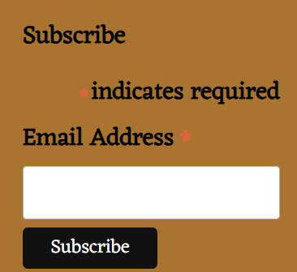

## Why Mailchimp for Our Newsletter?

- **User-Friendly Design:** Mailchimp's intuitive design tools made creating professional-looking emails easy.
- **Targeted Campaigns:** The platform allows for targeted campaigns, ensuring we reach the right audience.
- **Analytics:** Provides valuable insights on open rates and customer engagement, helping us refine future content.
- **Automation:** Enables scheduling and automating regular communication with our customers.
- **Integration:** Seamlessly integrates with other platforms and services we use.


[Back to top ⇧](#overview)

## SEO Strategy for Sanda Bazaar
Given the relatively low competition in SEO for Gotland-related content, Sanda Bazaar has a unique opportunity to establish a strong online presence. The following meta tags are optimized to leverage this advantage:

### Keywords Integration

#### Local and Cultural Focus
- `Gotland products`
- `Gotland bazaar`
- `cultural items Gotland`
- `Gotland artisan market`
- `Gotland handmade goods`

#### Summer Shop and Cafe
- `summer shop Gotland`
- `cafe in Gotland`
- `best coffee Gotland`
- `relaxing cafe Gotland`
- `peaceful coffee spot Gotland`

#### Second-Hand Market
- `second-hand market Gotland`
- `unique finds Gotland`
- `exclusive second-hand Gotland`

#### Tourist Attraction
- `Gotland tourist shop`
- `must-visit in Gotland`
- `destination Gotland shopping`

#### Online Presence
- `online shopping Gotland`
- `Gotland e-commerce`
- `Gotland gifts online`
- `buy Gotland products online`

#### Local Engagement
- `Gotland community market`
- `local bazaar Gotland`
- `Gotland local artisans`
- `support local Gotland`

### SEO and Content Strategy

- **Social Media**: Use keywords in posts for product promotion and event marketing.
- **Google My Business**: List physical location with relevant keywords.
- **Website Optimization**: Include keywords in meta tags, product descriptions, and content.

### Blog Content Strategy for Sanda Bazaar

Sanda Bazaar's blog will play a crucial role in boosting SEO and engaging visitors with valuable content. The focus will be on creating content that not only resonates with our audience but also leverages high-ranking topics related to Gotland.

### Key Focus Areas

#### 1. Linking to High-Ranking Gotland Sites
- **Strategic Partnerships**: Collaborate with or reference popular local sites like Destination Gotland.
- **Backlinking**: Include backlinks to high-ranking websites related to Gotland to enhance SEO and provide readers with valuable resources.

#### 2. Topics Related to Gotland
- **Local Insights**: Share unique insights, stories, and experiences about Gotland to attract readers interested in the region.
- **Travel and Tourism**: Post articles about traveling to and within Gotland, including tips, guides, and highlights of local attractions.

#### 3. Incorporating High-Ranking Keywords
- **Keyword Research**: Regularly research and integrate high-ranking keywords related to Gotland into our blog posts.
- **SEO Optimization**: Optimize each blog post with relevant keywords, meta descriptions, and tags to improve search engine rankings.

#### 4. Engaging and Informative Content
- **Quality Content**: Ensure each blog post is informative, engaging, and aligns with our audience's interests.
- **Regular Updates**: Maintain a consistent blogging schedule to keep our content fresh and encourage repeat visits.

### Measuring Success
- **Analytics**: Use tools like Google Analytics to track the performance of our blog posts, including visitor numbers, engagement rates, and referral sources.
- **Feedback**: Encourage and monitor reader comments and feedback to gauge the effectiveness of our content and adapt our strategy accordingly.

This content strategy aims to strengthen Sanda Bazaar's online presence, with a particular emphasis on showcasing and connecting with the Gotland community.

[Back to top ⇧](#overview)

## Agile Methodology

As a solo student embarking on this project, I've embraced a practical Agile approach to reach a Minimum Viable Product (MVP). This journey involved seven sprints, with the final, 7th sprint dedicated primarily to testing and bug fixing. This strategic focus ensures ample time to refine the project and guarantee its functionality.

While I recognize that my real-world project demands extensive work, I've deliberately kept this endeavor project-focused. This allows for a structured development process that can evolve as the project progresses.

I have established a Kanban board, organizing user stories and tasks in a sequential order of completion. This structure not only helps me track my progress but also ensures that I adhere to my original vision. Each task and EPIC added to the board reflects my commitment to fulfilling the foundational user stories and the overarching EPICs outlined in this README.

The goal has always been to achieve an MVP for this project. However, I'm aware that transitioning to an actual store launch entails much more development. This project will continue to evolve in a separate fork, highlighting the journey from MVP to a fully-fledged product launch.

Working in an Agile manner has taught me the importance of foresight and planning. Historically, planning wasn't my forte, but through development, I've learned its value. The Agile framework has been instrumental in preventing last-minute rushes and overwhelming workloads. I'm continuously exploring new Agile tools to enhance my planning process, making it more fluid and effective.

This learning journey in Agile methodology underscores the power of structured planning in software development. It's a journey of continuous improvement, learning, and adaptation.


[My Kanban Board](https://github.com/users/birgerosterberg/projects/4/)


[Back to top ⇧](#overview)

## Features
<details>
<summary style="font-size: larger;">Navbar Desktop and Mobile</summary>

- **Large & XL Screens:**
  - Always-visible search box for product searches by name and description.
  - Account Menu with links varying by login status and admin rights, including sign-in, profile, and site management.
  - Shopping bag icon displaying current bag contents and total value, with dynamic styling based on contents.
  - Home page and products dropdown links, including category-specific views.

- **Medium & Smaller Screens:**
  - Dropdown burger icon for compact navigation.
  - Links to home, products, and more, similar to larger screens.
  - Search icon triggering a dropdown search bar.
  - Account and shopping bag features similar to larger screens.

- **My Account Link Variations:**
  - Different types of links are available depending on the user's status:
    - Admin users get access to advanced site management options.
    - Logged-in users see personalized account options.
    - Not logged-in users are presented with options to sign-in or register.

  <details>
  <summary>Images Desktop Navbar</summary>

  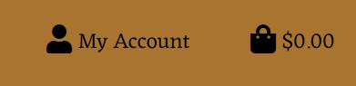
  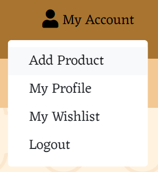
  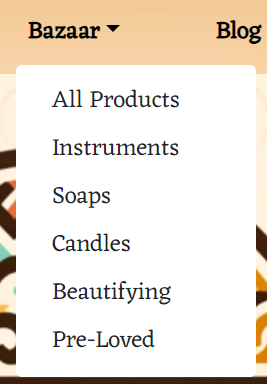
  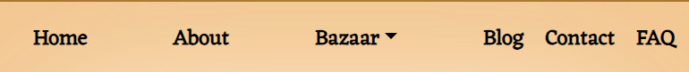
  
  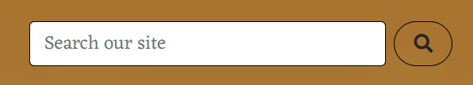
  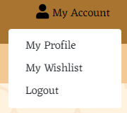
  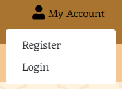
  </details>

  <details>
  <summary>Images Mobile Navbar</summary>

  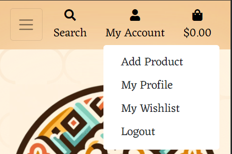
  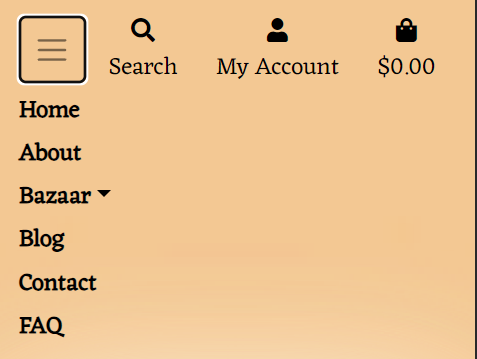
  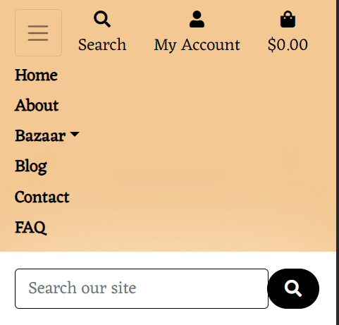

  </details>
</details>


<details>
<summary style="font-size: larger;">Open Times</summary>

- **Dynamic Display:**
  - Automatically checks the current day and displays corresponding open times.
  - If the shop is closed on a particular day, it shows "We're closed today."
  - Used for displaying weekly open times on both the Home and Contact pages.

- **Admin Panel Management:**
  - Open times for each day can be easily set and updated from the admin panel.
  - Eliminates the need for manual HTML changes, ensuring ease of management.

- **Customer Convenience:**
  - Provides visitors with accurate and up-to-date opening hours.
  - Particularly useful for local and visiting customers in Gotland, addressing common issues with changing open times.
  - Enhances the user experience on the Home and Contact pages by providing clear open time information.

- **Responsive Design:**
  - Seamlessly adapts to different devices, ensuring accessibility for all users.

- **Value to Customers:**
  - Ensures customers always have the most current information on shop availability.
  - Enhances user experience by offering clear, instant insights into shop open times.

  <details>
  <summary>Images Open Times</summary>

  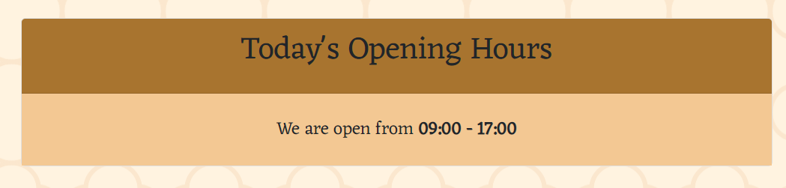
  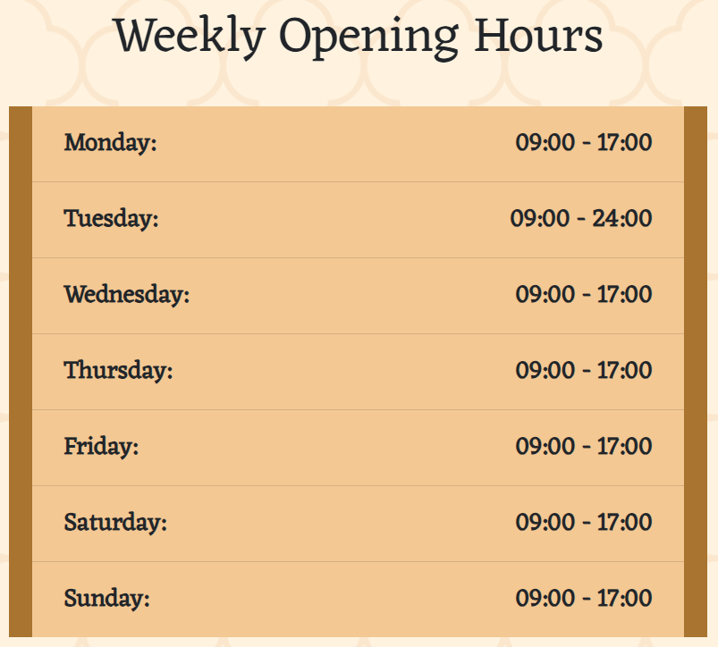
  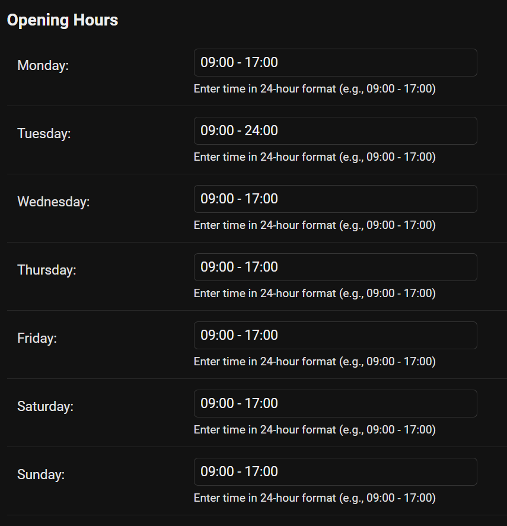

  </details>
</details>


<details>
<summary style="font-size: larger;">Blog Functionality</summary>

- **Homepage Sneak Peek:**
  - Features a snippet and link to the latest blog post, designed to pique visitor interest.

- **Blog Page:**
  - Displays an image along with the full text of each blog post.

- **Admin Management with Summernote for Django:**
  - The blog post editor uses Summernote, a rich text editor for Django, enhancing the content creation experience.
  - Provides an easy-to-use interface for creating and editing blog posts.
  - Offers an overview of all blog posts and simplifies the process of adding new blog posts.
  <details>
  <summary>Blog images</summary>

  
  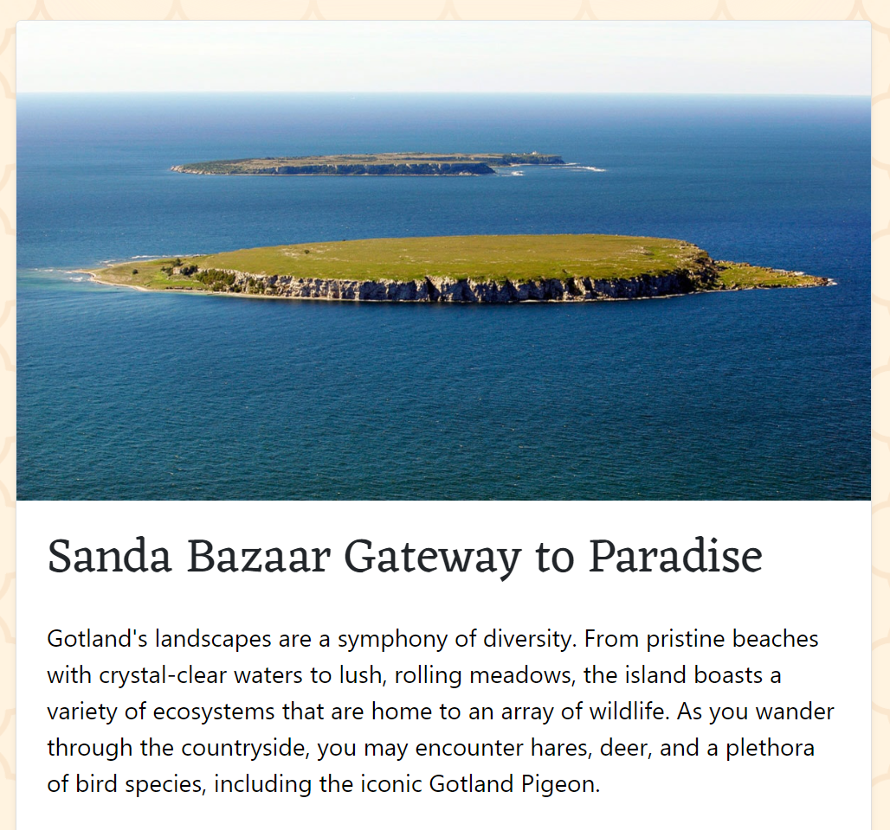
  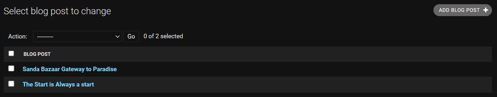
  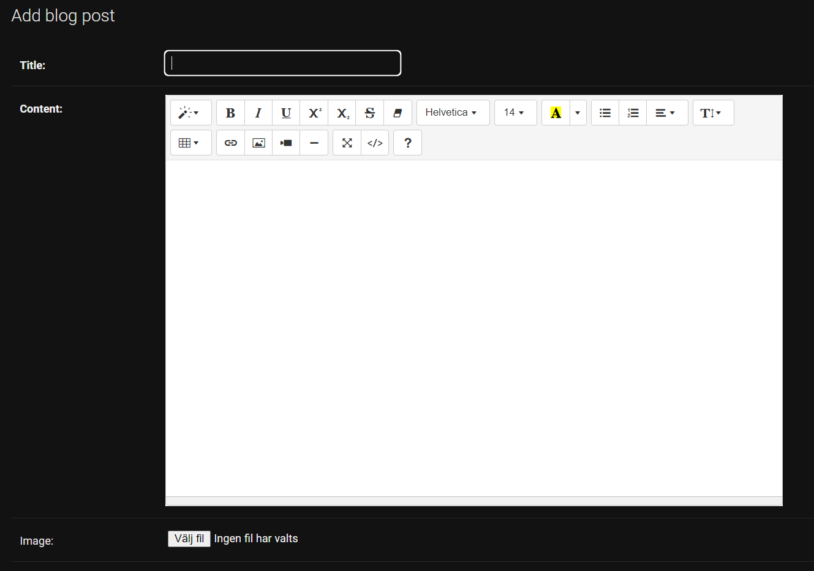
 
  </details>
</details>


<details>
<summary style="font-size: larger;">Product Features</summary>

- **Bazaar - Product Categories:**
  - Access to various product categories through the main 'Bazaar' link.
  - Sub-links for category-based filtering, allowing users to narrow down their search.

- **Sorting Functionality:**
  - Offers different sorting options, including by rating, price, or popularity.
  - For instance, selecting 'Rating' organizes products from highest to lowest rated.

- **Products Home:**
  - A comprehensive view featuring all products without any category filtering.
  - For general users: Displays product image, name, price, category (clickable), and rating (or 'No rating' if not rated).
  - Product images are interactive, leading users to detailed product pages.

- **Admin CRUD Functionality:**
  - Enhanced control for admins on `bazaar.html` and individual product detail pages.
  - Includes Create, Read, Update, and Delete operations for products.
  - Safety features like confirmation prompts for deleting products.

- **Product Details Page:**
  - Detailed view of each product upon clicking its image.
  - Displays product name, price, category, and rating.
  - Edit and Delete options for admins, with a focus on ease of administration.

- **Quantity Selection and Bag Addition:**
  - Users can adjust the quantity of products before adding to the bag.
  - Interactive - and + buttons for adjusting the number of items.
  - Confirmation through a toast message, indicating successful addition to the bag and providing a quick link.

- **Admin Product Editing and Adding:**
  - Dedicated views for admins to edit existing products or add new ones.
  - Features include image management, detail editing, and category selection.
  - Reminder to use WEBP format images of 380x380px for consistency.

  <details>
  <summary>Product Features Images</summary>

  
  
  
  
  
  
  
  
  
  

  </details>
</details>


<details>
<summary style="font-size: larger;">Shopping Bag Feature</summary>

- **Bag Icon Indication:**
  - The bag icon on the page header changes color based on its contents.
  - A yellowish background indicates the presence of items in the bag.

- **Inside the Shopping Bag:**
  - Displays all items added to the shopping bag.
  - Each item has options to adjust quantity or remove it from the bag.
  - Instant update and feedback via a toast message when an item is removed.

- **Quantity Adjustment and Bag Total:**
  - Users can change the quantity of items directly in the bag.
  - Updating the quantity recalculates the Bag Total and delivery charges.
  - Essential for a seamless shopping experience.

- **Empty Bag Notification:**
  - If the bag is empty, users are clearly informed.
  - Displays the amount needed to spend for free delivery.

- **Proceeding to Checkout:**
  - A prominent 'Secure Checkout' button leads users to the checkout page.
  - Ensures a smooth transition from shopping to completing the purchase.

  <details>
  <summary>Shopping Bag Features Images</summary>

  
  
  

  </details>
</details>


<details>
<summary style="font-size: larger;">Checkout Process</summary>

- **Order Summary:**
  - Displays a summary of the order including items, quantities, and prices.
  - Breakdown of Order Total, Delivery Charges, and Grand Total.

- **Delivery Information:**
  - Fields for entering delivery address and contact information.
  - Option for logged-in users to save delivery information to their profile.

- **Payment Processing:**
  - Secure card information input for payment processing.
  - Integration with Stripe for handling transactions.
  - Real-time error handling for incorrect or incomplete card details.

- **Order Confirmation:**
  - On successful payment, redirection to a checkout success page.
  - Toast message displaying the order number and email confirmation details.
  - Email confirmation sent to the user's email address.

- **Stripe Webhooks:**
  - Utilization of Stripe webhooks for backend confirmation of payment success.
  - Enables real-time tracking and management of transactions.

- **Post-Checkout:**
  - Email receipt and order details sent to the user.
  - Option for reviewing and managing the order in the user's account.

  <details>
  <summary>Checkout Process Images</summary>

  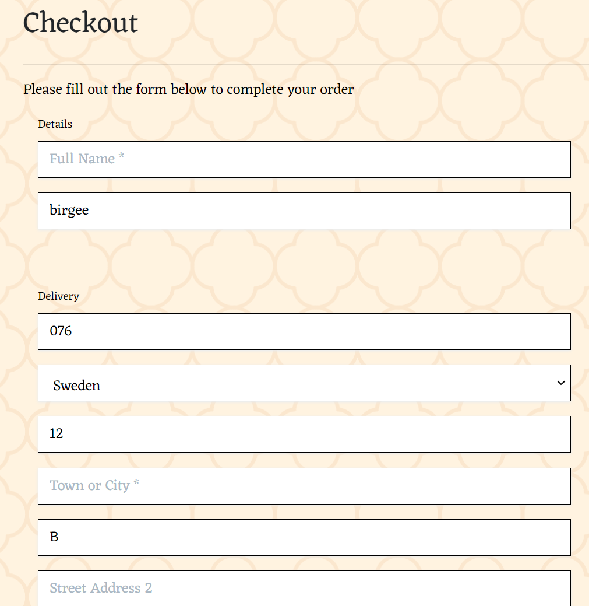
  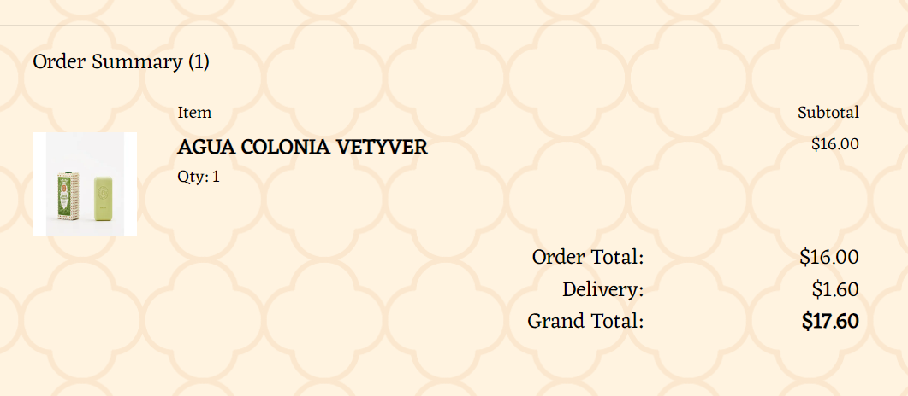
  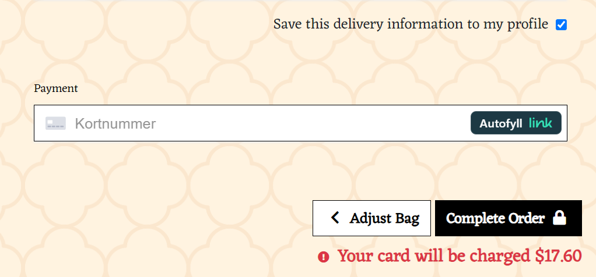
  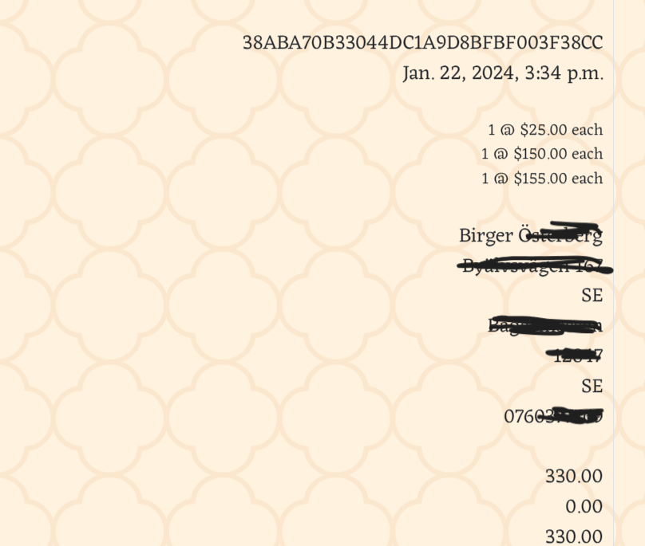
  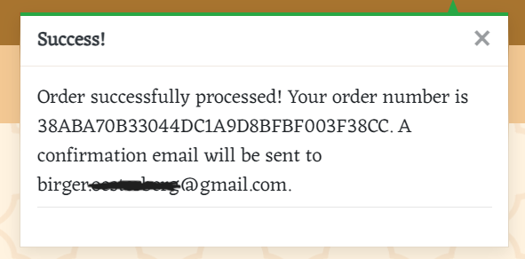
  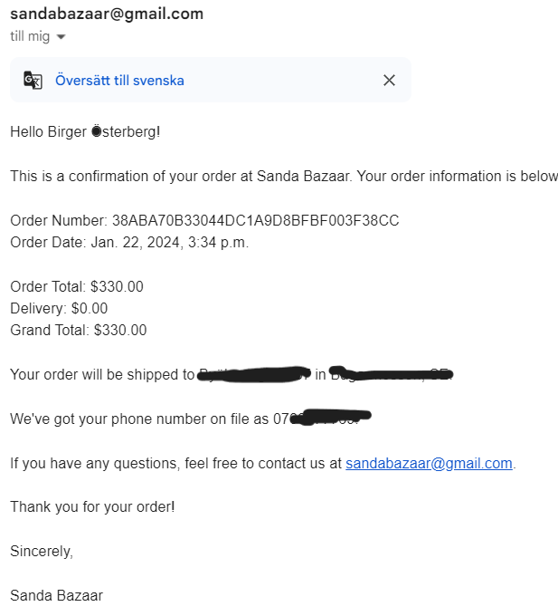
  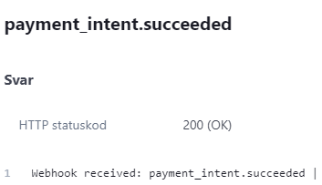
  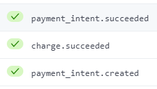

  </details>
</details>


<details>
<summary style="font-size: larger;">Profile Management</summary>

- **Accessing the Profile:**
  - 'My Profile' option available in the dropdown under the My account icon in the navbar.
  - Easily accessible for logged-in users.

- **Updating Default Delivery Information:**
  - Users can update their default delivery address and contact information.
  - Simple and intuitive interface for editing and saving new details.

- **Order History Review:**
  - A comprehensive list of past orders available in the profile.
  - Each order number is clickable, leading to a detailed order confirmation page.
  - Toast messages provide additional context and confirmation details for each order.

- **Order Confirmation Details:**
  - Detailed view of past orders including items purchased, quantities, and total cost.
  - Useful for tracking previous purchases and order references.

  <details>
  <summary>Profile Management Images</summary>

  
  
  

  </details>
</details>


<details>
<summary style="font-size: larger;">Product Review and Rating System</summary>

- **Eligibility for Reviewing:**
  - Only users who have purchased a product can leave a review for it.
  - Ensures authenticity and relevance of the reviews.

- **Review Submission:**
  - Simple interface for submitting reviews with a 1 to 5 star rating.
  - Hover effect on stars for intuitive interaction and ease of use.

- **Visibility of Reviews:**
  - All visitors can view the ratings and reviews for each product.
  - Provides transparency and assists in informed purchasing decisions.

- **Average Rating Calculation:**
  - Automatically updates the product's average rating with each new review.
  - Helps future customers gauge overall satisfaction with the product.

- **Handling No Reviews:**
  - If there are no reviews for a product, a clear message indicates this on the page.
  - Maintains a clean and user-friendly interface.

  <details>
  <summary>Product Review System Images</summary>

  
  
  

  </details>
</details>

<details>
<summary style="font-size: larger;">Wishlist Feature</summary>

- **Adding Products to Wishlist:**
  - 'Add to Wishlist' button available on each product's detail page.
  - Allows users to save products they are interested in for future reference.

- **Accessing the Wishlist:**
  - Users can find their Wishlist under 'My Account' and 'My Wishlist'.
  - Provides a dedicated space to view all wished-for items.

- **Wishlist Features:**
  - Displays all products added to the Wishlist.
  - Each item includes a link back to its detailed product page for easy access.
  - Option to remove items from the Wishlist with a simple button click.

- **User-Specific Wishlist:**
  - Wishlist is user-specific, storing desired items for each individual account.
  - Enhances the shopping experience by allowing users to keep track of their interests.

  <details>
  <summary>Wishlist Feature Images</summary>

  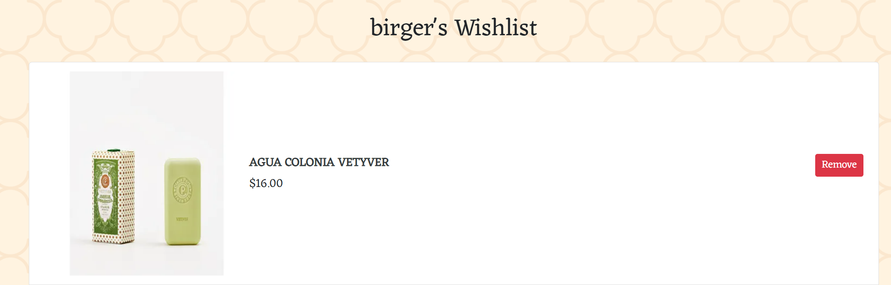
  

  </details>
</details>

<details>
<summary style="font-size: larger;">Contact Page</summary>

- **Contact Information:**
  - Provides the physical address of the summer shop.
  - Includes a mailto link for easy email access.
  - Features a clickable telephone link (currently a placeholder number).

- **Google Maps Integration:**
  - Embedded Google Maps to assist customers in finding the shop's location.
  - Offers a user-friendly and interactive way to view the shop's geographical position.

- **Simplicity and Efficiency:**
  - The contact page is designed to be straightforward and user-friendly.
  - Ensures customers can easily find the necessary contact details and shop location.

  <details>
  <summary>Contact Page Images</summary>

  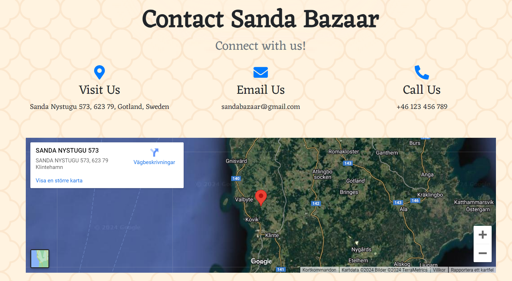

  </details>
</details>

<details>
<summary style="font-size: larger;">FAQ Page</summary>

- **Accordion-Style Questions:**
  - Questions are listed in an accordion format for efficient browsing.
  - Users can click on each question to expand and view the corresponding answer.

- **Ease of Use:**
  - Designed to avoid overwhelming users with text.
  - Makes it easier to find specific information without scrolling through long text.

- **Frequently Asked Questions:**
  - Covers a wide range of common queries and concerns.
  - Answers are concise yet informative, providing quick and clear responses.

- **Benefits of Accordion Layout:**
  - Enhances user experience by keeping the FAQ page organized and uncluttered.
  - Facilitates quicker access to relevant information.

  <details>
  <summary>FAQ Page Images</summary>

  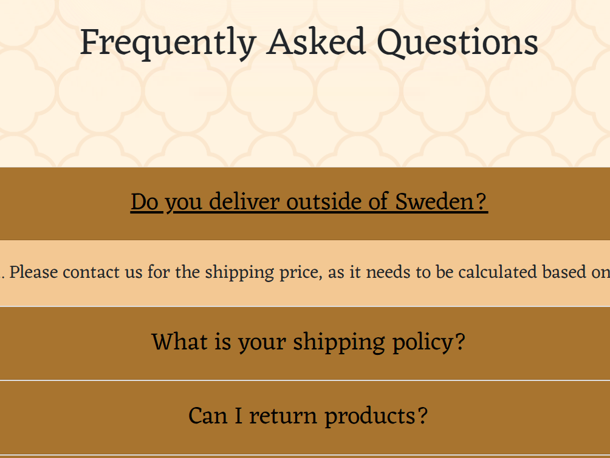

  </details>
</details>

<details>
<summary style="font-size: larger;">Website Footer</summary>

- **Visit Us Address:**
  - Displays the physical address of the shop, inviting users to visit.

- **Privacy Policy Link:**
  - Provides a direct link to the website's privacy policy page.
  - Ensures easy access to important legal information regarding user data and privacy.

- **Newsletter Subscription:**
  - Users can sign up for a newsletter via a subscription form.
  - Integrated with MailChimp for efficient newsletter management and distribution.

- **Social Media Links:**
  - Includes links to the website's social media profiles.
  - Offers users a way to stay connected and updated through various social platforms.

- **Design and Accessibility:**
  - The footer is designed for ease of navigation and quick access to important links.
  - Ensures that essential information and features are accessible from every page.

  <details>
  <summary>Footer Images</summary>

  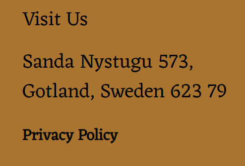
  
  

  </details>
</details>


[Back to top ⇧](#overview)

---

## Database

<details>
<summary>Category Model</summary>

- name: `CharField` (max_length=254)
- friendly_name: `CharField` (max_length=254, null=True, blank=True)
</details>

<details>
<summary>Product Model</summary>

- category: `ForeignKey` to 'Category' (null=True, blank=True)
- sku: `CharField` (max_length=254, null=True, blank=True)
- name: `CharField` (max_length=254)
- description: `TextField`
- price: `DecimalField` (max_digits=6, decimal_places=2)
- rating: `DecimalField` (max_digits=6, decimal_places=2, null=True, blank=True)
- image_url: `URLField` (max_length=1024, null=True, blank=True)
- image: `ImageField` (null=True, blank=True)
</details>

<details>
<summary>BlogPost Model</summary>

- title: `CharField` (max_length=200)
- content: `TextField`
- published_date: `DateTimeField` (auto_now_add=True)
- image: `ImageField` (upload_to='blog_images/', blank=True, null=True)
</details>

<details>
<summary>OpeningHours Model</summary>

- monday: `CharField` (max_length=50, blank=True)
- tuesday: `CharField` (max_length=50, blank=True)
- wednesday: `CharField` (max_length=50, blank=True)
- thursday: `CharField` (max_length=50, blank=True)
- friday: `CharField` (max_length=50, blank=True)
- saturday: `CharField` (max_length=50, blank=True)
- sunday: `CharField` (max_length=50, blank=True)
</details>

<details>
<summary>UserProfile Model</summary>

- user: `OneToOneField` to 'User' (on_delete=models.CASCADE)
- default_phone_number: `CharField` (max_length=20, null=True, blank=True)
- default_street_address1: `CharField` (max_length=80, null=True, blank=True)
- default_street_address2: `CharField` (max_length=80, null=True, blank=True)
- default_town_or_city: `CharField` (max_length=40, null=True, blank=True)
- default_county: `CharField` (max_length=80, null=True, blank=True)
- default_postcode: `CharField` (max_length=20, null=True, blank=True)
- default_country: `CountryField` (blank_label='Country', null=True, blank=True)
</details>

<details>
<summary>Review Model</summary>

- product: `ForeignKey` to 'Product' (on_delete=models.CASCADE)
- user: `ForeignKey` to 'User' (on_delete=models.CASCADE)
- review_text: `TextField`
- rating: `IntegerField`
- created_at: `DateTimeField` (auto_now_add=True)
</details>

<details>
<summary>Wishlist Model</summary>

- user: `OneToOneField` to 'User' (on_delete=models.CASCADE)
- products: `ManyToManyField` to 'Product'
</details>

<details>
<summary>Checkout Model</summary>

- Order:
  - order_number: `CharField` (max_length=32, null=False, editable=False)
  - user_profile: `ForeignKey` to 'UserProfile' (on_delete=models.SET_NULL, null=True, blank=True)
  - full_name: `CharField` (max_length=50, null=False, blank=False)
  - email: `EmailField` (max_length=254, null=False, blank=False)
  - phone_number: `CharField` (max_length=20, null=False, blank=False)
  - country: `CountryField` (blank_label='Country *', null=False, blank=False)
  - postcode: `CharField` (max_length=20, null=True, blank=True)
  - town_or_city: `CharField` (max_length=40, null=False, blank=False)
  - street_address1: `CharField` (max_length=80, null=False, blank=False)
  - street_address2: `CharField` (max_length=80, null=True, blank=True)
  - county: `CharField` (max_length=80, null=True, blank=True)
  - date: `DateTimeField` (auto_now_add=True)
  - delivery_cost: `DecimalField` (max_digits=6, decimal_places=2, null=False, default=0)
  - order_total: `DecimalField` (max_digits=10, decimal_places=2, null=False, default=0)
  - grand_total: `DecimalField` (max_digits=10, decimal_places=2, null=False, default=0)
  - original_bag: `TextField` (null=False, blank=False, default='')
  - stripe_pid: `CharField` (max_length=254, null=False, blank=False, default='')

- OrderLineItem:
  - order: `ForeignKey` to 'Order' (null=False, blank=False, on_delete=models.CASCADE)
  - product: `ForeignKey` to 'Product' (null=False, blank=False, on_delete=models.CASCADE)
  - quantity: `IntegerField` (null=False, blank=False, default=0)
  - lineitem_total: `DecimalField` (max_digits=6, decimal_places=2, null=False, blank=False, editable=False)
</details>

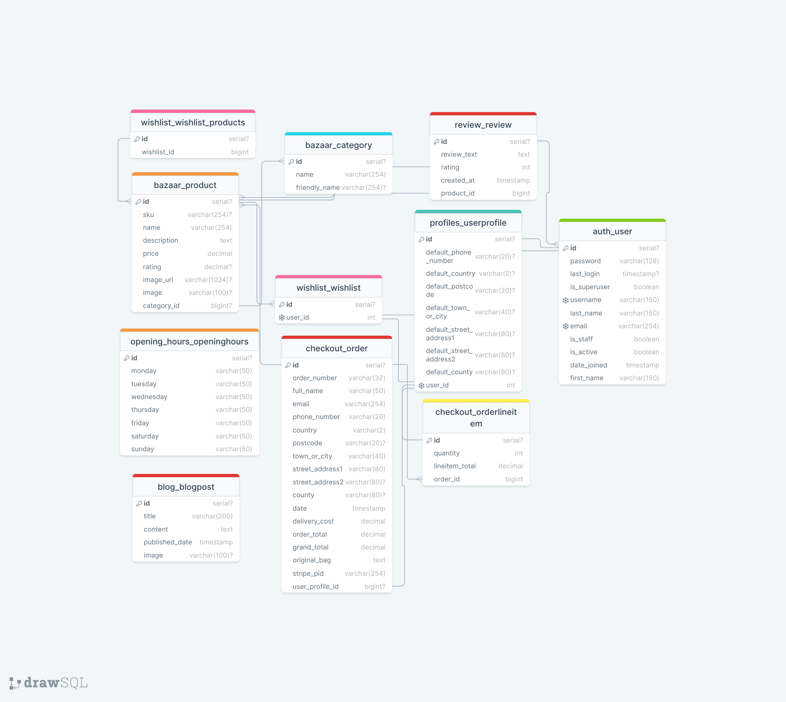

## Responsive Layout and Design
[Link to separate testing readme](/TESTING.md)

[Back to top ⇧](#overview)


## Technologies Used

- **HTML**:
  - The structure of the Website was developed using HTML as the main language.
- **CSS**:
  - The Website was styled using custom CSS in an external file.
- **JavaScript**:
  - Used to manipulate the DOM.
- **Bootstrap**:
  - Used throughout the site for responsiveness, layout, and predefined style elements.
- **Font Awesome**:
  - Used for various icons throughout the site.
- **Favicon.io**:
  - Favicon files were created at [Favicon.io Converter](https://favicon.io/favicon-converter/).
- **Python**:
  - The main programming language used for the application.
- **Django**:
  - Python web framework used for building the application.
- **AWS**: 
  - [AWS](https://aws.amazon.com/) - for storing media and static data.
- **W.A.V.E.**: 
  - [W.A.V.E.](https://wave.webaim.org/) - for testing accessibility.
- **ElephantSql**: 
  - [ElephantSql](https://www.elephantsql.com/) - for hosting the PostgreSQL database migrated from Heroku.
- **Grammarly**: 
  - [Grammarly](https://app.grammarly.com/) - for correcting text content.
- **Balsamiq**: 
  - [Balsamiq](https://balsamiq.com/wireframes/) - for creating wireframes.
- **Gmail**: 
  - [Gmail](https://gmail.com) - for sending emails using the SMTP server.
- **DrawSQL**: 
  - [DrawSQL](https://drawsql.app/) - for visual database design and documentation.


  [Back to top ⇧](#overview)


## Testing
[Link to separate testing readme](/TESTING.md)

[Back to top ⇧](#overview)


## Deployment

### Version Control

1. **The Site**

- The Site was created using VSCode workspace and pushed to GitHub.

2. **Adding Files to Staging**

- Run `git add .` to add files to the staging area.

3. **Committing Changes**

- Run `git commit -m "commit message"` to commit changes to the local repository.

4. **Pushing Changes**

- Run `git push` to push committed code to GitHub.

### Forking the Repository

1. **Locate Repository**

- Log into GitHub and locate the repository.

2. **Fork Repository**

- Click the "Fork" button.

### Making a Local Clone

1. **Locate Repository on GitHub**

- Log into GitHub and find the repository.

2. **Copy Repository URL**

- Click the 'Code' dropdown and copy the URL.

3. **Open Git Bash**

- Open Git Bash in your IDE.

4. **Clone Repository**

- Run `git clone <URL>`.

5. **Install Requirements**

- Run `pip install -r requirements.txt` to install the necessary packages.

[Back to top ⇧](#overview)


### Database (ElephantSQL)
1. Navigate to the [ElephantSQL website](https://www.elephantsql.com/) and log in.
2. Click on "Create New Instance" in the top-right corner.
3. Enter a database name, leave the plan field as is, optionally enter tags.
4. Select your region, click "Review", and then "Create instance".
5. In your dashboard, find the newly created database instance and click on it.
6. Copy the URL starting with `postgres://`.
7. Paste this URL into `env.py` file as `DATABASE_URL` value:

   ```python
   os.environ["DATABASE_URL"] = "postgres://yourLinkFromDatabaseDashboard"

### Django Secret Key
- To secure the Django app, set the secret key as an environment variable:

  ```python
  os.environ["SECRET_KEY"] = "yourSecretKey"

### Deploying on Heroku
1. **Create a New App on Heroku**:
   - Navigate to [Heroku](https://heroku.com/), log in and open the dashboard.
   - Click "New" > "Create new app".
   - Enter your app name, choose a region, and click "Create app".

2. **Connect to GitHub**:
   - In the "Deploy" tab, go to "Deployment method" section.
   - Authorize and connect your GitHub account, then select your repository.

3. **Set Configuration Variables**:
   - Go to the "Settings" tab and click "Reveal Config Vars".
   - Add the following keys and values:
     | Key                    | Value                                 |
     |------------------------|---------------------------------------|
     | AWS_ACCESS_KEY_ID      | `aws url beginning with aws://`       |
     | DATABASE_URL           | `postgress url beginning with postgress://` |
     | DISABLE_COLLECTSTATIC  | `1`                                   |
     | SECRET_KEY             | `YourSecretKey`                       |

   - Note: `DISABLE_COLLECTSTATIC` should be `1` for initial deployment and removed before final deployment.

4. **Update Django Settings**:
   - In `settings.py`, update `ALLOWED_HOSTS` with your Heroku app's URL.

5. **Prepare for Deployment**:
   - Ensure `Procfile` is correct, e.g., `web: gunicorn sanda_bazaar.wsgi:application`.
   - Create a `runtime.txt` file in your project root.
   - Push changes to GitHub.
   - Specify the Python version, `python-3.11.4`.

6. **Manual Deploy**:
   - In Heroku's "Deploy" tab, under "Manual deploy", select the main branch and click "Deploy Branch".

7. **Final Deployment Steps**:
   - Remove `DISABLE_COLLECTSTATIC` variable in Heroku's settings.

8. **Access Deployed App**:
   - After build completion, access your app via the provided link.

[Back to top ⇧](#overview)

## AWS (Amazon Web Services) Setup for Sanda Bazaar

AWS is utilized for storing all static and media files of Sanda Bazaar.

### S3 Bucket Setup
1. **Create an AWS Account**: 
   - Sign up or log in at [AWS](https://aws.amazon.com/).

2. **Create and Configure an S3 Bucket**: 
   - In AWS, navigate to S3 (All Services > Storage > S3).
   - Click 'Create Bucket'.
   - Name the bucket (using the project's name is recommended), select your region.
   - In 'Object Ownership', select 'ACLs enabled'.
   - Uncheck 'Block all public access'.
   - Enable 'Static website hosting' in the bucket properties.
   - Set CORS Configuration:
     ```json
     [
         {
             "AllowedHeaders": ["Authorization"],
             "AllowedMethods": ["GET"],
             "AllowedOrigins": ["*"],
             "ExposeHeaders": []
         }
     ]
     ```

3. **Set Bucket Policy and Permissions**:
   - Use the AWS Policy Generator to create an S3 Bucket Policy (select 'S3 Bucket Policy').
   - Allow all principals (`*`) and select 'Get object'.
   - Paste your Bucket ARN into the policy generator and append `/*` to the resource key.
   - In the ACL section, grant 'list' access to 'Everyone (public access)'.

### IAM (Identity and Access Management) Configuration
1. **Create a User Group and Policy**:
   - In IAM, create a user group (e.g., 'manage-your-project-name').
   - Create a policy with S3 full access, customized with your bucket's ARN.

2. **Create an IAM User**:
   - Add a new user with programmatic access to your group.
   - Download the CSV file containing access keys.

#### Connecting AWS to django

Now that you have created a S3 bucket with its user group attached, we need to connect it to django.

1. First you will need to install two packages. Boto3 and Django storages. Do this by running these commands:  
    ```
    pip3 install boto3
    pip3 install django-storages
    ```
    And remember to freeze the requirements with:  
    ```
    pip3 freeze > requirements.txt
    ```
2. You will then need to add 'storages' to your installed apps section inside your settings.py file. Do that now. 
3. Next, we will need to add some additional settings to the same file to let django know what bucket it's communicating with. 
4. Somewhere near the bottom of the file you should write an if statement to check if there is an environment variable called USE_AWS. This variable does not exist yet but we will add it later. Inside the if statement, write the following settings so it looks like this:  
    ```
    if 'USE_AWS' in os.environ:
        AWS_STORAGE_BUCKET_NAME = 'insert-your-bucket-name-here'
        AWS_S3_REGION_NAME = 'insert-your-region-here'
        AWS_ACCESS_KEY_ID = os.environ.get('AWS_ACCESS_KEY_ID')
        AWS_SECRET_ACCESS_KEY = os.environ.get('AWS_SECRET_ACCESS_KEY')
    ```
5. Next, hop back to heroku and in the settings tab, under config vars, you will need to add some keys with values that were downloaded earlier in the CSV file.
6. Add the key, AWS_ACCESS_KEY_ID with the value that was generated in the CSV file earlier. Then add the key AWS_SECRET_ACCESS_KEY, and again add the value that was generated in the CSV file. Once they have both been added, add the key USE_AWS, and set the value to True.
7. You can now also remove the DISABLE_COLLECTSTAIC variable, since django should now collect static files automatically and upload them to S3.
8. Now head back to the settings.py file in your django project and head back to the if statement we wrote earlier and inside the statement add this line setting:  
    ```
    AWS_S3_CUSTOM_DOMAIN = f'{AWS_STORAGE_BUCKET_NAME}.s3.amazonaws.com'
    ```
    This is to tell django where our static files will be coming from in production.
9. Next we need to create a file to tell django that we want to use S3 to store our static files whenever someone runs collectstatic and also that we want any uploaded product images to go there also.
10. In the root directory of your project create a file called 'custom_storages.py'. Inside this file you will need to import your settings as well as the s3boto3 storage class. So at the top of the file insert the code:  
    ```
    from django.conf import settings
    from storages.backends.s3boto3 import S3Boto3Storage
    ```
11. Then underneath the imports insert these two classes:  
    ```
    class StaticStorage(S3Boto3Storage):
        location = settings.STATICFILES_LOCATION


    class MediaStorage(S3Boto3Storage):
        location = settings.MEDIAFILES_LOCATION
    ```
    The STATICFILES_LOCATION and MEDIAFILES_LOCATION have yet to be defined, so lets do that now.
12. Back in the settings.py file, underneath the bucket config settings but still inside the if statement, add these lines:  
    ```
    STATICFILES_STORAGE = 'custom_storages.StaticStorage'
    STATICFILES_LOCATION = 'static'
    DEFAULT_FILE_STORAGE = 'custom_storages.MediaStorage'
    MEDIAFILES_LOCATION = 'media'
    ```
13. Next, you will also need to override and explicitly set the URLs for static and media files using your custom domain and new locations. To do this add these two lines inside the same if statement:  
    ```
    STATIC_URL = f'https://{AWS_S3_CUSTOM_DOMAIN}/{STATICFILES_LOCATION}/'
    MEDIA_URL = f'https://{AWS_S3_CUSTOM_DOMAIN}/{MEDIAFILES_LOCATION}/'
    ```
14. If you now save, add, commit and push your changes, you should see that your S3 bucket now has a static folder with all your static files inside. Next, we need to handle the Media files but first, inside the if statement add the following code. This helps to speed things up by letting the browser know that its ok to cache static files for a long time:    
    ```
    AWS_S3_OBJECT_PARAMETERS = {
        'Expires': 'Thu, 31 Dec 2099 20:00:00 GMT',
        'CacheControl': 'max-age=94608000',
    }
    ```
15. Back in S3, go to your bucket and click 'Create folder'. Name the folder 'media' and click 'Save'. 
16. Inside the new media folder you just created, click 'Upload', 'Add files', and then select all the images that you are using on your site.
17. Then under 'Permissions' select the option 'Grant public-read access' and click upload. You may need to also check an acknowledgment warning checkbox too. 
18. Once that is finished you're all set. All your static files and media files should be automatically linked from django to your S3 bucket.missions to 'public-read' during upload.

[Back to top ⇧](#overview)


### Stripe

Stripe is needed to handle the checkout process when a payment is made. You will need a stripe account which you can sign up for [here](https://stripe.com/en-gb).

#### Payments

1. To set up stripe payments you can follow their guide [here](https://stripe.com/docs/payments/accept-a-payment#web-collect-card-details).

#### Webhooks

1. To set up a webhook, sign into your stripe account and click 'Developers' located in the top right of the navbar.
2. Then in the side-nav under the Developers title, click on 'Webhooks', then 'Add endpoint'.
3. On the next page you will need to input the link to your heroku app followed by /checkout/wh/. It should look something like this:  
    ```
    https://your-app-name.herokuapp.com/checkout/wh/
    ```
4. Then click '+ Select events' and check the 'Select all events' checkbox at the top before clicking 'Add events' at the bottom. Once this is done finish the form by clicking 'Add endpoint'.
5. Your webhook is now created and you should see that it has generated a secret key. You will need this to add to your heroku config vars.
6. Head over to your app in heroku and navigate to the config vars section under settings. You will need the secret key you just generated for your webhook, in addition to your Publishable key and secret key that you can find in the API keys section back in stripe.
7. Add these values under these keys:  
    ```
    STRIPE_PUBLIC_KEY = 'insert your stripe publishable key'
    STRIPE_SECRET_KEY = 'insert your secret key'
    STRIPE_WH_SECRET = 'insert your webhooks secret key'
    ```
8. Finally, back in your setting.py file in django, insert the following near the bottom of the file:  
    ```
    STRIPE_PUBLIC_KEY = os.getenv('STRIPE_PUBLIC_KEY', '')
    STRIPE_SECRET_KEY = os.getenv('STRIPE_SECRET_KEY', '')
    STRIPE_WH_SECRET = os.getenv('STRIPE_WH_SECRET', '')
    ```
[Back to top ⇧](#overview)

## Credits

- [Stack Overflow](https://stackoverflow.com/) \
  A treasure trove of knowledge that was instrumental in bringing this project to life.

- [dev.to](https://dev.to/) \
  An invaluable resource full of insightful information.

- [r/django on Reddit](https://www.reddit.com/r/django/) \
  A fantastic community with a wealth of information to offer.

- [MDN](https://developer.mozilla.org/en-US/docs/Learn/Server-side/Django) \
  Mozilla's MDN Web Docs—another indispensable resource I can't forget!

- [Django Project Docs DB Model](https://docs.djangoproject.com/en/4.2/topics/db/models/) \
  Offers excellent explanations for building models.

- [Ask Python's Django Models](https://www.askpython.com/django/django-models) \
  Yet another incredible resource for understanding model creation.

- [Django Project Forum](https://forum.djangoproject.com/) \
  The name says it all!

- [CodeInstitute Boutique Ado](https://github.com/Code-Institute-Solutions/boutique_ado_v1/) \
  A good coder is a lazy coder; much of Sanda Bazaar wouldn't work without this resource!

- [Django AllAuth Docs](https://django-allauth.readthedocs.io/en/latest/) \
  Comprehensive information on how AllAuth functions.

- [GeeksForGeeks CRUD](https://www.geeksforgeeks.org/class-based-generic-views-django-create-retrieve-update-delete/) \
  Extremely useful for understanding Views, Templates, and CRUD operations, since it provides many interesting extra links for further study.

- [Bootstrap Documentation](https://getbootstrap.com/docs/5.3/getting-started/introduction/) \
  Building this project would have been both a headache and a nightmare without this!

- [Gareth McGirr](https://github.com/Gareth-McGirr) \
  Provided excellent guidance throughout the project.

- [Css Generators](https://css-generators.com/) \
  For the amazing sitewide background done with pure CSS!

- [Image editing](https://www.iloveimg.com/) \
  Resizing and cutting out things from images!

- [FontAwesome](https://fontawesome.com/) \
  Thanks for the simple integration of icons in my life!

- [FreeConvert](https://www.freeconvert.com/) \
  Quickest and smoothest way to create my WEBP images!

- [Codemy Youtube](https://www.youtube.com/watch?v=u6R4vBa7ZK4&list=PLCC34OHNcOtpRfBYk-8y0GMO4i1p1zn50) \
  Good extra information on how to build an eCommerce website!

- [TechWithTim   Youtube](https://www.youtube.com/watch?v=IlS1aR_gfzs) \
  Reminder of what is important when programming!

- [TechWithTim   Youtube](https://www.youtube.com/watch?v=nGIg40xs9e4) \
  Amazing reminder of Django from time to time!
