# Testing

Back to [README.MD](README.md)

## Table of contents
* [User Story and Feature Testing](#user-story-and-feature-testing)
    - [Viewing and Navigation EPIC](#viewing-and-navigation-epic)
    - [User Registration/Authentication EPIC](#user-registrationauthentication-epic)
    - [Products EPIC](#products-epic)
    - [Reviews EPIC](#reviews-epic)
    - [Wishlist EPIC](#wishlist-epic)
    - [Bag EPIC](#bag-epic)
    - [Checkout EPIC](#checkout-epic)
    - [User Profile EPIC](#user-profile-epic)
    - [Admin Manage Orders EPIC](#admin-manage-orders-epic)
    - [Newsletter EPIC](#newsletter-epic)
    - [About EPIC](#about-epic)
    - [Contact EPIC](#contact-epic)
    - [Blog EPIC](#blog-epic)
    - [FAQs Page EPIC](#faqs-page-epic)

* [Feature Testing](#feature-testing)
* [Responsiveness](#responsiveness)
* [Code Validation](#code-validation)
* [Performance Optimization](#performance-optimization)
* [Lighthouse Score](#lighthouse-score)
* [Bugs](#bugs)

[Back to top ⇧](#table-of-contents)


## User Story and Feature Testing

### Viewing and Navigation EPIC

#### As a User, I Want to Understand the Purpose of the Website from the First Interaction

**Objective:** Ensure the website communicates its purpose clearly and immediately. \
**Outcome:** All tests have behaved as expected and have passed.

##### Testing Criteria:

- **Clarity Test:** Verify if the landing page clearly communicates the website's purpose.
- **First-Time User Feedback:** Collect feedback from first-time visitors about their initial impression.
- **Load Time Analysis:** Check key elements load quickly and without delay.

#### As a User, I Want to Be Able to Easily Use the Site Functionalities on All Viewports

**Objective:** Ensure the website is functional and user-friendly on various devices. \
**Outcome:** All tests have behaved as expected and have passed.

##### Testing Criteria:

- **Responsive Design Test:** Check the website on different screen sizes and resolutions.
- **Functionality Test on Different Devices:** Test all functionalities on multiple devices.
- **Performance Testing:** Evaluate the website's performance across different devices.

#### As a User, I Want to See a Footer with Relevant Information and Documents

**Objective:** Ensure the footer contains all necessary information and is easily accessible. \
**Outcome:** All tests have behaved as expected and have passed.

##### Testing Criteria:

- **Content Verification:** Check for essential elements like contact information and policies.
- **Accessibility Test:** Ensure the footer is easily accessible from any page.
- **Link Functionality Test:** Verify that all links in the footer are functional.

#### As a User, I Want to Be Able to Access a Navigation Menu at Any Time

**Objective:** Ensure users can access the navigation menu easily from any part of the website. \
**Outcome:** All tests have behaved as expected and have passed.

##### Testing Criteria:

- **Visibility Test:** Confirm that the navigation menu is visible from every page.
- **Interactive Elements Test:** Test the functionality of the menu on various devices.
- **User Flow Analysis:** Track user navigation for intuitiveness.

#### As a User, I Want to Be Able to Search Through Site Products by Entering a Key Word

**Objective:** Enable users to effectively search for products using keywords. \
**Outcome:** All tests have behaved as expected and have passed.

##### Testing Criteria:

- **Search Functionality Test:** Verify the search feature with various keywords.
- **Result Relevance and Speed:** Assess the relevance and speed of search results.
- **Filter and Sort Options:** Check the effectiveness of filter and sort options.

[Back to top ⇧](#table-of-contents)

---

### User Registration/Authentication EPIC

#### As a User, I Want to Be Able to Register on the Website

**Objective:** Provide a user-friendly registration process.  
**Outcome:** All tests have behaved as expected and have passed.

##### Testing Criteria:

- **Registration Process Test:** Ensure the registration page is easily accessible and user-friendly.
- **Form Submission Test:** Check that the registration form submits correctly with valid information.
- **Confirmation Message Test:** Verify a confirmation message appears after successful registration.


#### As a User, I Want to Be Able to Confirm My Account with an Email

**Objective:** Implement email confirmation for account security.  
**Outcome:** All tests have behaved as expected and have passed.

##### Testing Criteria:

- **Email Receipt Test:** Confirm that a confirmation email is sent after registration.
- **Link Functionality Test:** Ensure the confirmation link in the email is functional and leads to account confirmation.
- **Account Confirmation Test:** Verify that the account is active after email confirmation.


#### As a User/Admin, I Want to Be Able to Authenticate Using Only Email and Password

**Objective:** Enable secure login using email and password.  
**Outcome:** All tests have behaved as expected and have passed.

##### Testing Criteria:

- **Login Functionality Test:** Check the login process with valid email and password.
- **Error Handling Test:** Ensure incorrect login attempts are handled appropriately.
- **Session Verification Test:** Confirm that a user session starts after successful login.


#### As a User, I Want to Be Able to Reset My Password in Case I Forgot It

**Objective:** Provide a secure and straightforward password reset process.  
**Outcome:** All tests have behaved as expected and have passed.

##### Testing Criteria:

- **Password Reset Option Test:** Verify the 'Forgot Password' link is available and functional.
- **Email Link Test:** Ensure a password reset email is sent with a valid link.
- **Password Reset Functionality Test:** Test the process of setting a new password via the provided link.


#### As a User/Admin, I Want to Be Able to Log Out at Any Time

**Objective:** Ensure a smooth and secure logout process.  
**Outcome:** All tests have behaved as expected and have passed.

##### Testing Criteria:

- **Logout Functionality Test:** Check that the logout option is easily accessible and functional.
- **Session Termination Test:** Confirm that the user session ends after logging out.
- **Redirect Post-Logout Test:** Ensure the user is redirected to an appropriate page after logging out.

[Back to top ⇧](#table-of-contents)

---

### Products EPIC

#### As a User, I Want to See a Catalog with All the Products and Also Grouped by Categories

**Objective:** Provide an organized and comprehensive product catalog.  
**Outcome:** All tests have behaved as expected and have passed.

##### Testing Criteria:

- **Catalog Display Test:** Ensure all products are listed and properly categorized.
- **Category Grouping Test:** Verify products are grouped by categories for easy browsing.


#### As a User, I Want to Be Able to Apply Filters and to Sort the Listed Products

**Objective:** Enable users to filter and sort products to find what they need easily.  
**Outcome:** All tests have behaved as expected and have passed.

##### Testing Criteria:

- **Filter Functionality Test:** Confirm that filters work correctly and accurately.
- **Sort Functionality Test:** Ensure sorting options effectively rearrange products.


#### As a User, I Want to See a Page with Full Specifications for Every Product

**Objective:** Provide detailed information for each product.  
**Outcome:** All tests have behaved as expected and have passed.

##### Testing Criteria:

- **Product Information Test:** Verify each product page contains comprehensive specifications.


#### As a User, I Want to Be Able to Add Any Product to the Shopping Bag in a Selected Quantity

**Objective:** Facilitate a seamless addition of products to the shopping bag.  
**Outcome:** All tests have behaved as expected and have passed.

##### Testing Criteria:

- **Add to Bag Functionality Test:** Ensure users can add products to the shopping bag in the desired quantity.


#### As an Admin, I Want to Be Able to Edit Product Details

**Objective:** Allow admins to update product information.  
**Outcome:** All tests have behaved as expected and have passed.

##### Testing Criteria:

- **Edit Functionality Test:** Confirm admins can modify product details accurately.


#### As an Admin, I Want to Be Able to Delete Products from the Catalog

**Objective:** Enable admins to remove products from the catalog.  
**Outcome:** All tests have behaved as expected and have passed.

##### Testing Criteria:

- **Delete Functionality Test:** Ensure admins can delete products from the catalog efficiently.


#### As an Admin, I Want to Be Able to Add New Products to Catalog

**Objective:** Facilitate the addition of new products to the catalog by admins.  
**Outcome:** All tests have behaved as expected and have passed.

##### Testing Criteria:

- **Add New Product Test:** Verify admins can successfully add new products to the catalog.

[Back to top ⇧](#table-of-contents)

---

### Reviews EPIC

#### As a User, I Want to Be Able to See All the Reviews Added for Any Product

**Objective:** Ensure users can view reviews for products to inform their purchase decisions.  
**Outcome:** All tests have behaved as expected and have passed.

##### Testing Criteria:

- **Review Visibility Test:** Check if all reviews are visible on each product's page.
- **Review Detail Test:** Ensure each review displays relevant information like the date, rating, and user comments.

#### As a Logged-in User, I Want to Be Able to Add a Review for Any Product I Have Purchased

**Objective:** Allow logged-in users to contribute reviews for products they've purchased.  
**Outcome:** All tests have behaved as expected and have passed.

##### Testing Criteria:

- **Review Submission Test:** Verify that logged-in users can submit reviews for products they have purchased.
- **User Feedback Validation Test:** Confirm that the review form captures relevant feedback effectively.

#### As a User, I Want to Be Able to See a General Rating of Every Product

**Objective:** Display an overall rating for each product based on user reviews.  
**Outcome:** All tests have behaved as expected and have passed.

##### Testing Criteria:

- **Rating Display Test:** Ensure that each product page shows an aggregated rating from user reviews.
- **Rating Accuracy Test:** Confirm that the displayed rating accurately reflects the sum/average of individual review ratings.

[Back to top ⇧](#table-of-contents)

---

### Wishlist EPIC

#### As a Logged-in User, I Want to Be Able to Add/Remove Any Product from the Wishlist

**Objective:** Provide a seamless experience for users to manage their Wishlist.  
**Outcome:** All tests have behaved as expected and have passed.

##### Testing Criteria:

- **Add to Wishlist Test:** Confirm that logged-in users can add products to their Wishlist.
- **Remove from Wishlist Test:** Ensure that users can remove items from their Wishlist easily.

#### As a Logged-in User, I Want to See All the Products Added to Wishlist

**Objective:** Enable users to view their Wishlist with all added products.  
**Outcome:** All tests have behaved as expected and have passed.

##### Testing Criteria:

- **Wishlist Display Test:** Check if the Wishlist page correctly displays all products that a user has added.
- **Wishlist Accessibility Test:** Ensure that the Wishlist is easily accessible from the user's account or main navigation.

[Back to top ⇧](#table-of-contents)

---

### Bag EPIC

#### As a User, I Want to See All the Products I Added to the Shopping Bag

**Objective:** Ensure users can view all items they have added to their shopping bag.  
**Outcome:** All tests have behaved as expected and have passed.

##### Testing Criteria:

- **Bag Content Display Test:** Verify that the shopping bag correctly displays all added products.
- **Item Visibility Test:** Check if each item in the shopping bag is visible with necessary details.

#### As a User, I Want to Be Able to Add/Remove Any Product from the Shopping Bag

**Objective:** Provide flexibility for users to manage the contents of their shopping bag.  
**Outcome:** All tests have behaved as expected and have passed.

##### Testing Criteria:

- **Add to Bag Functionality Test:** Ensure that users can easily add products to their shopping bag.
- **Remove from Bag Functionality Test:** Confirm that users can remove items from the shopping bag as needed.

#### As a User, I Want to See All the Details About the Price for the Order

**Objective:** Display clear and comprehensive pricing details for the user's order.  
**Outcome:** All tests have behaved as expected and have passed.

##### Testing Criteria:

- **Price Detail Test:** Check that the shopping bag page displays all pricing details, including item prices, shipping, and total cost.
- **Accuracy Test:** Verify that the displayed prices are accurate and updated in real time as items are added or removed.

#### As a User, I Want to Be Able to Edit the Quantity of the Products

**Objective:** Allow users to easily adjust the quantity of products in their shopping bag.  
**Outcome:** All tests have behaved as expected and have passed.

##### Testing Criteria:

- **Quantity Edit Functionality Test:** Ensure users can change the quantity of items in the shopping bag.
- **Update Reflect Test:** Confirm that changes in quantity are accurately reflected in the bag's total and item count.

[Back to top ⇧](#table-of-contents)

---

### Checkout EPIC

#### As a Logged-in User, I Want to Be Able to See and Edit My Default Delivery Details for the Order

**Objective:** Allow logged-in users to view and modify their default delivery information easily.  
**Outcome:** All tests have behaved as expected and have passed.

##### Testing Criteria:

- **Default Details Display Test:** Ensure that the default delivery details are displayed correctly for logged-in users.
- **Edit Functionality Test:** Verify that users can edit their default delivery information without issues.

#### As a User, I Want to See the Order Summary with All the Price Details

**Objective:** Provide users with a comprehensive summary of their order, including all price details.  
**Outcome:** All tests have behaved as expected and have passed.

##### Testing Criteria:

- **Order Summary Visibility Test:** Check that the order summary is clearly visible and includes itemized price details.
- **Total Price Accuracy Test:** Ensure that the total price, including taxes and shipping, is calculated and displayed accurately.

#### As a User, I Want to Be Able to Add My Delivery Details for the Order

**Objective:** Enable users to input their delivery details for the order.  
**Outcome:** All tests have behaved as expected and have passed.

##### Testing Criteria:

- **Delivery Details Entry Test:** Confirm that users can enter their delivery details accurately.
- **Form Validation Test:** Ensure the delivery details form validates the entered information correctly.

#### As a User, I Want to Be Able to Introduce My Card Details for Payment

**Objective:** Facilitate secure and easy entry of card details for payment.  
**Outcome:** All tests have behaved as expected and have passed.

##### Testing Criteria:

- **Card Details Entry Test:** Check that users can input their card details securely and accurately.
- **Payment Processing Test:** Verify that the payment process works correctly with the entered card details.

[Back to top ⇧](#table-of-contents)

---

### User Profile EPIC

#### As a Logged-in User, I Want to Be Able to See and Edit My Delivery Details

**Objective:** Provide a feature for logged-in users to view and update their delivery information.  
**Outcome:** All tests have behaved as expected and have passed.

##### Testing Criteria:

- **Delivery Details Visibility Test:** Ensure that the user's delivery details are accurately displayed in their profile.
- **Edit Functionality Test:** Verify that users can edit their delivery details and save changes effectively.

#### As a Logged-in User, I Want to Be Able to See My Orders History

**Objective:** Enable users to view their past orders.  
**Outcome:** All tests have behaved as expected and have passed.

##### Testing Criteria:

- **Order History Display Test:** Confirm that the user's order history is visible and includes all relevant past orders.
- **Order Detail Accuracy Test:** Check that the details of each order in the history are correct and comprehensive.

#### As a Logged-in User, I Want to See the Full Details for Every Order I Placed on the Website

**Objective:** Ensure users can access detailed information for each of their orders.  
**Outcome:** All tests have behaved as expected and have passed.

##### Testing Criteria:

- **Detailed Order View Test:** Verify that users can view full details for each order, including product specifics and price.
- **Information Clarity Test:** Ensure that the order details are presented clearly and comprehensively.

[Back to top ⇧](#table-of-contents)

---

### Admin Manage Orders EPIC

#### As an Admin, I Want to Be Able to See All the Orders Placed on the Website Grouped by Date

**Objective:** Enable admins to view all orders, organized chronologically.  
**Outcome:** All tests have behaved as expected and have passed.

##### Testing Criteria:

- **Order Grouping Test:** Verify that orders are correctly grouped and displayed by date on the admin panel.
- **Order Visibility Test:** Ensure that all orders, regardless of status, are visible to the admin.

#### As an Admin, I Want to Be Able to Filter the Orders by Date

**Objective:** Provide a feature for admins to filter orders based on specific dates.  
**Outcome:** All tests have behaved as expected and have passed.

##### Testing Criteria:

- **Filter Functionality Test:** Confirm that the date filter accurately sorts and displays orders based on the selected dates.
- **Usability Test:** Check the ease of use and responsiveness of the date filter feature.

#### As an Admin, I Want to See Full Details of Every Order Placed on the Website

**Objective:** Ensure that admins can access comprehensive details for each order.  
**Outcome:** All tests have behaved as expected and have passed.

##### Testing Criteria:

- **Detailed View Test:** Verify that full details of each order (including customer information, order contents, prices, and status) are accessible and correctly displayed.
- **Detail Accuracy Test:** Ensure the accuracy and completeness of the information presented for each order.

[Back to top ⇧](#table-of-contents)

---

### Newsletter EPIC

#### As a User, I Want to Be Able to Subscribe to a Newsletter

**Objective:** Provide an easy and accessible way for users to subscribe to the website's newsletter.  
**Outcome:** All tests have behaved as expected and have passed.

##### Testing Criteria:

- **Subscription Process Test:** Ensure that the newsletter subscription process is user-friendly and straightforward.
- **Confirmation Test:** Verify that users receive a confirmation message or email after subscribing.

#### As an Admin, I Can Keep Track of All Our Subscribers

**Objective:** Allow admins to effectively monitor and manage the list of newsletter subscribers.  
**Outcome:** All tests have behaved as expected and have passed.

##### Testing Criteria:

- **Subscriber List Management Test:** Confirm that admins can access and manage the subscriber list efficiently.
- **Data Accuracy Test:** Ensure the accuracy and up-to-date status of the subscriber information.

#### Utilizing the Newsletter as a Marketing Tool to Increase Revenue

**Objective:** Leverage the newsletter as an effective marketing tool to engage customers and promote sales.  
**Outcome:** All tests have behaved as expected and have passed.

##### Testing Criteria:

- **Marketing Content Test:** Evaluate the effectiveness of the newsletter content in terms of user engagement and promotion clarity.
- **Distribution and Reach Test:** Verify the reach and delivery success rate of the newsletter to the subscribers.

[Back to top ⇧](#table-of-contents)

---

### About EPIC

#### As a User, I Want a Clear Link to the About Page to Learn About Sanda Bazaar

**Objective:** Ensure easy navigation to the About page for users seeking information about Sanda Bazaar.  
**Outcome:** All tests have behaved as expected and have passed.

##### Testing Criteria:

- **Link Visibility Test:** Check if the link to the About page is clearly visible and accessible from the main navigation or other appropriate areas of the website.
- **Navigation Test:** Verify that the link correctly navigates to the About page.

#### As a User, I Want to See Who's Behind Sanda Bazaar, Adding a Personal Touch

**Objective:** Provide information about the philosophy behind Sanda Bazaar on the About page.  
**Outcome:** All tests have behaved as expected and have passed.

##### Testing Criteria:

- **Content Accuracy Test:** Ensure that the About page contains accurate and updated information about the philosophy behind Sanda Bazaar.
- **Personal Touch Evaluation:** Assess how well the About page conveys a personal connection to the users, enhancing the brand's image and trustworthiness.

[Back to top ⇧](#table-of-contents)

---

### Contact EPIC

#### As a User, I Can Easily Navigate to the Website's Contact Page

**Objective:** Provide straightforward navigation to the Contact page on the website.  
**Outcome:** All tests have behaved as expected and have passed.

##### Testing Criteria:

- **Navigation Test:** Check if the link to the Contact page is easily accessible and clearly marked on the website.
- **Link Functionality Test:** Verify that the link leads directly to the Contact page.

#### As a User, I Can Find the Bazaar's Location, Opening Hours, and Contact Number and Email Address

**Objective:** Ensure the Contact page contains complete and accurate information about the bazaar's location, opening hours, and contact details.  
**Outcome:** All tests have behaved as expected and have passed.

##### Testing Criteria:

- **Information Accuracy Test:** Confirm that the location, opening hours, contact number, and email address are correctly displayed and up-to-date.
- **Layout and Visibility Test:** Ensure that this information is presented in an easy-to-find and readable format.

#### As a User, I Can Use the Google Map to Locate the Bazaar's Exact Location

**Objective:** Integrate a functional Google Map on the Contact page for easy location of the bazaar.  
**Outcome:** All tests have behaved as expected and have passed.

##### Testing Criteria:

- **Map Functionality Test:** Test the Google Map integration to ensure it accurately pinpoints the bazaar's location.
- **User Interaction Test:** Check the usability of the map feature, including zoom and navigation controls.

#### As a User, I Want Easy Access to Contact Info and Social Media Links on the Contact Page

**Objective:** Provide users with easy access to comprehensive contact information and social media links.  
**Outcome:** All tests have behaved as expected and have passed.

##### Testing Criteria:

- **Contact Info Accessibility Test:** Verify that contact information is prominently displayed and easy to access.
- **Social Media Link Functionality Test:** Ensure that social media links are up-to-date and direct users to the correct pages.

[Back to top ⇧](#table-of-contents)

---

### Blog EPIC

#### As a User, I Want to Easily Find and Access the Blog Page to Explore Topics Related to Sanda Bazaar

**Objective:** Ensure the blog page is easily accessible and discoverable on the website for users interested in Sanda Bazaar-related content.  
**Outcome:** All tests have behaved as expected and have passed.

##### Testing Criteria:

- **Navigation and Accessibility Test:** Check if the blog page is straightforward to locate and access from the main website.
- **Link Functionality Test:** Verify that links directing to the blog page work correctly and load efficiently.

#### As a User, I'm Interested in Reading Diverse Blog Posts That Cover a Range of Topics

**Objective:** Provide a variety of blog posts that encompass different aspects of Sanda Bazaar, from cultural insights to behind-the-scenes stories.  
**Outcome:** All tests have behaved as expected and have passed.

##### Testing Criteria:

- **Content Diversity Test:** Evaluate the range of topics covered in the blog posts to ensure diversity and relevance.
- **Engagement Test:** Assess user engagement with the blog posts through metrics like time spent on page and user comments.

#### As a User, I Want the Blog to Feature Engaging and Well-Written Content

**Objective:** Deliver high-quality, engaging, and well-written blog content to captivate and retain user interest.  
**Outcome:** All tests have behaved as expected and have passed.

##### Testing Criteria:

- **Content Quality Test:** Review the blog posts for writing quality, including clarity, style, and correctness.
- **User Engagement Test:** Measure user engagement through indicators such as comments, shares, and return visits.

#### As a User, I'm Looking for Visually Appealing Blog Posts, with Images or Videos

**Objective:** Enhance the blog with visually appealing elements like images or videos to enrich the storytelling experience.  
**Outcome:** All tests have behaved as expected and have passed.

##### Testing Criteria:

- **Visual Content Test:** Ensure that blog posts include high-quality and relevant images or videos.
- **Integration and Presentation Test:** Check the integration of visual elements for coherence and enhancement of the blog's appeal.

[Back to top ⇧](#table-of-contents)

---

### FAQs Page EPIC

#### As a User, I Can Easily Navigate to the Website's FAQs Page

**Objective:** Ensure that users can find and access the FAQs page without difficulty.  
**Outcome:** All tests have behaved as expected and have passed.

##### Testing Criteria:

- **Navigation Test:** Check if the link to the FAQs page is clearly visible and accessible from the main website.
- **Link Functionality Test:** Verify that the link directs users accurately to the FAQs page.

#### As a User, I Can Get All the Answers to Common Questions

**Objective:** Provide comprehensive and clear answers to frequently asked questions, addressing common user concerns and inquiries.  
**Outcome:** All tests have behaved as expected and have passed.

##### Testing Criteria:

- **Content Completeness Test:** Ensure that the FAQs cover a wide range of common questions relevant to users.
- **Clarity and Accuracy Test:** Verify that the answers are easy to understand and accurate.

[Back to top ⇧](#table-of-contents)

---
## Feature Testing

The following table summarizes the results of extensive feature testing conducted on the website. Each feature was thoroughly tested to ensure functionality, accuracy, and user experience.

| Feature | Description | Status |
|---------|-------------|--------|
| All Links | Ensures that every link on the website is operational and leads to the correct destination. | ✅ Passed |
| Image Display | Verifies that all images are displayed correctly across the site. | ✅ Passed |
| Product Links | Checks that links associated with products lead to the correct product details. | ✅ Passed |
| User-Specific Links | Confirms that the correct links are displayed to the appropriate users. | ✅ Passed |
| Profile Login | Ensures each user's profile login is correctly functioning. | ✅ Passed |
| Order History | Validates that users can view their correct order history. | ✅ Passed |
| Wishlist | Assures that the wishlist feature is user-specific and functions correctly. | ✅ Passed |
| Admin Product Management | Tests admin capabilities to add, edit, and delete products. | ✅ Passed |
| Product Reviews and Ratings | Verifies that users who purchased can leave reviews and ratings, and these are displayed correctly. | ✅ Passed |
| Open Times | Checks the accuracy and functionality of displayed open times. | ✅ Passed |
| Error Pages | Ensures that error pages like 404, 403, etc., are working as intended. | ✅ Passed |
| Responsive Navbar | Confirms the navbar works correctly on all devices and pages. | ✅ Passed |
| Admin Functions | Verifies all administrative functions are operational. | ✅ Passed |
| Email Notifications | Tests that emails are sent out appropriately in various scenarios. | ✅ Passed |
| Shopping Bag Additions | Checks the functionality of adding items to the shopping bag, including accurate price display. | ✅ Passed |
| Shopping Bag Removals | Ensures items can be removed from the shopping bag with the correct price update. | ✅ Passed |
| Quantity Updates | Verifies that updating item quantities in the shopping bag updates the price correctly. | ✅ Passed |
| Contact Information Accuracy | Confirms that all contact information displayed is correct. | ✅ Passed |
| Checkout Email Functionality | Tests the sending of emails during the checkout process. | ✅ Passed |
| Stripe Webhook | Ensures the Stripe webhook functions as intended. | ✅ Passed |
| Stripe Payment | Verifies the Stripe payment process works correctly. | ✅ Passed |
| Blog Post Display | Checks that blog posts are correctly displayed on the blog and home pages. | ✅ Passed |
| Toast Notifications | Tests the functionality and display of toast notifications. | ✅ Passed |

[Back to top ⇧](#table-of-contents)

---

## Automated Tests

In the development of "Sanda Bazaar", automated tests play a crucial role in ensuring the reliability and functionality of the Bag, Bazaar, and Checkout apps. While tests have been successfully implemented for the Bag and Bazaar apps, the Checkout app requires further refinement and integration with Stripe.

### Bag App Tests

#### Purpose
The Bag app tests are designed to validate the functionality of the shopping bag, including adding, adjusting, and removing items.

#### Status
The Bag app tests have been successfully implemented and are running without issues.

### Bazaar App Tests

#### Purpose
The Bazaar app tests focus on the core functionality of the e-commerce platform, including product listings and user interactions.

#### Status
The Bazaar app tests have been successfully implemented and are running without issues.

### Checkout App Tests

#### Purpose
The Checkout app tests aim to ensure the seamless processing of orders, including Stripe payment integration and order creation.

#### Status
The Checkout app tests are currently facing challenges related to Stripe integration and need further attention and testing.

### How to Run Automated Tests in Django

To run the automated tests for each app, use the following commands in your Django project:

1. **Bag App Tests**:
    ```bash
    python manage.py test bag --verbosity=2
    ```

2. **Bazaar App Tests**:
    ```bash
    python manage.py test bazaar --verbosity=2
    ```

3. **Checkout App Tests**:
    ```bash
    python manage.py test checkout --verbosity=2
    ```

The `--verbosity=2` flag increases the verbosity level, providing more detailed information about the tests being run.


Automated testing is a fundamental part of ensuring the quality and reliability of Sanda Bazaar. With continued practice and refinement, the Checkout app tests can also be successfully integrated, providing a robust and fully tested e-commerce solution.

[Back to top ⇧](#table-of-contents)

---

## Responsiveness

#### Test Description:

To test the responsiveness of the website on various mobile devices, ensuring that all elements scale and function properly on different screen sizes and browsers.

#### Tested Devices and Browsers:

- iPhone 12 (Safari, Chrome)
- iPhone 13 Pro Max (Safari, Chrome)
- iPhone 15 (Safari)
- iPhone 14 (Safari)
- iPad (Safari, Chrome)

#### Test Steps and Results:

| Device            | Browser | Test Steps                                                         | Expected Results                                  | Actual Results      | Status                                  |
| ----------------- | ------- | ------------------------------------------------------------------ | ------------------------------------------------- | ------------------- | --------------------------------------- |
| iPhone 12         | Safari  | 1. Open the website and navigate through different functionalities | Website should be fully functional and responsive | Behaved as expected | <span style="color:green">Passed</span> |
| iPhone 12         | Chrome  | 1. Open the website and navigate through different functionalities | Website should be fully functional and responsive | Behaved as expected | <span style="color:green">Passed</span> |
| iPhone 13 Pro Max | Safari  | 1. Open the website and navigate through different functionalities | Website should be fully functional and responsive | Behaved as expected | <span style="color:green">Passed</span> |
| iPhone 13 Pro Max | Chrome  | 1. Open the website and navigate through different functionalities | Website should be fully functional and responsive | Behaved as expected | <span style="color:green">Passed</span> |
| iPhone 14         | Safari  | 1. Open the website and navigate through different functionalities | Website should be fully functional and responsive | Behaved as expected | <span style="color:green">Passed</span> |
| iPhone 15         | Safari  | 1. Open the website and navigate through different functionalities | Website should be fully functional and responsive | Behaved as expected | <span style="color:green">Passed</span> |
| iPad              | Safari  | 1. Open the website and navigate through different functionalities | Website should be fully functional and responsive | Behaved as expected | <span style="color:green">Passed</span> |
| iPad              | Chrome  | 1. Open the website and navigate through different functionalities | Website should be fully functional and responsive | Behaved as expected | <span style="color:green">Passed</span> |

#### Notes:

- The website is responsive and fully functional on all tested devices and browsers.
- All tests have passed.

## Browser Compatibility Testing

Manual testing was conducted to ensure compatibility across various browsers. The following browsers were used for testing:

- **Google Chrome**: Extensive testing was done to ensure full functionality and layout consistency.
- **Mozilla Firefox**: Tested for compatibility, focusing on performance and rendering.
- **Apple Safari**: Checked for compatibility, particularly with respect to design elements and user interface.

[Back to top ⇧](#table-of-contents)

---

## Accessibility

Wave Accessibility tool was used throughout development and for final testing of the deployed website to ensure aid in accessibility testing.

### Testing Criteria

Testing focused on the following criteria:

- **Color Contrast**: Meeting a minimum ratio as specified in [WCAG 2.1 Contrast Guidelines](https://www.w3.org/TR/WCAG21/#contrast-minimum).
- **Heading Levels**: Ensuring no heading levels are missed or skipped.
- **Landmarks**: All content is contained within landmarks for ease of assistive technology.
- **Non-Textual Content**: Providing alternative text or titles for all non-textual content.
- **HTML Page Lang**: Setting the HTML page lang attribute.
- **Aria Properties**: Ensuring correct implementation of Aria properties.
- **Coding Best Practices**: Following WCAG 2.1 coding best practices.

Manual tests were also performed to make the website as accessible as possible. A few accessibility issues were identified and subsequently fixed.

[Back to top ⇧](#table-of-contents)

---

## Code Validation

In addition to the accessibility tests, several other tests were conducted to ensure the code quality and standard compliance of the project.

### W3C Testing

#### CSS Validation
I conducted CSS validation using the W3C CSS Validator (https://jigsaw.w3.org/css-validator/). Initially, there were a few errors in the following files:

- `base.css`
- `profile.css`
- `checkout.css`

However, after addressing these minor issues, all files passed the validation without any further remarks.

#### HTML Validation
The HTML validation was a bit more challenging due to the use of Django templates. I used the W3C Markup Validation Service (https://validator.w3.org/) for this purpose. Here's how I approached it:

1. **Source Code Extraction**: Since my templates are in Django, I had to manually navigate to each page, use the 'Show Source' option to get the raw HTML.

2. **Validation and Debugging**: After pasting the HTML into the validator, I encountered numerous errors. Initially, the volume of errors was overwhelming, but by addressing them one by one, I was able to resolve most of them. Interestingly, fixing one particular error related to an overly wide `<a>` tag in `home.html` also resolved a longstanding design issue.

3. **Remaining Challenges**: There are still unresolved errors in the `Blog` and `Add Product` pages, primarily due to complexities with Summernote and Crispy Forms. As these issues aren't critical, I've decided to temporarily leave them as is, considering the current stage as a Minimum Viable Product (MVP).

#### Tested Documents
The following documents were tested and validated (except for the noted exceptions):

| Document                               | Status  |
| -------------------------------------- | ------- |
| `about.html`                           | Passed  |
| `bag.html`                             | Passed  |
| `add_product.html`                     | Errors  |
| `edit_product.html`                    | Passed  |
| `bazaar.html`                          | Passed  |
| `product_detail.html`                  | Passed  |
| `custom_clearable_file_input.html`     | Passed  |
| `blog.html`                            | Errors  |
| `checkout.html`                        | Passed  |
| `checkout_success.html`                | Passed  |
| `contact.html`                         | Passed  |
| `faq.html`                             | Passed  |
| `index.html`                           | Passed  |
| `profile.html`                         | Passed  |
| `500.html`                             | Passed  |
| `404.html`                             | Passed  |
| `403.html`                             | Passed  |
| `400.html`                             | Passed  |
| `base.html`                            | Passed  |
| `mobile-top-header.html`               | Passed  |
| `navbar.html`                          | Passed  |
| `wishlist_page.html`                   | Passed  |

[Back to top ⇧](#table-of-contents)

---

## JSHint Validation Results

I used [JSHint](https://jshint.com/) for JavaScript code validation. Here are the results for each file:

### Files with No Errors
- `custom_script.js`: No error.
- `star_rating.html`: No error.
- `stripe_elements.js`: No error, but note on Stripe.
- `upd_rmv.html`: No error.
- `image.html`: No error.
- `qty_in_script.html`: No error.

### Special Notes
- In `stripe_elements.js`, JSHint reports `Stripe is undefined`, but this is a false positive as Stripe is defined elsewhere (likely an external script).

### Minor Adjustments
- `countryfield.js`: Removed an unnecessary semicolon.

### Additional Information
- JSHint is a tool to detect errors and potential problems in JavaScript code. It is flexible and can be adjusted based on specific coding guidelines or project requirements.
- For `Stripe is undefined` issue in `stripe_elements.js`, this is a common scenario when using global variables from external libraries. JSHint might not recognize external globals unless explicitly told about them (using a comment directive or a configuration file).

[Back to top ⇧](#table-of-contents)

---

## PEP8 Testing

### Initial Approach
- **Tool Used**: Code Institute Python Linter.
- **Observations**: Began with the Code Institute Python Linter, but later realized that Flake8 was more efficient in finding errors.
- **Cross-Checking**: Performed some checks with the Code Institute Python Linter for validation against Flake8 findings.

## Transition to Flake8
Flake8 was adopted due to its efficiency and comprehensive error detection capabilities, especially for long lines. Migration files were excluded from the checks.

### Installing Flake8
Flake8 can be installed using pip. The command for installation is:
```
pip install flake8
```

### Using Flake8
1. **Project-Wide Analysis**:
   To run Flake8 for the entire project, use the following command in the root directory of the project:
   ```
   flake8
   ```
   This checks all Python files in the project for PEP8 compliance.

2. **Directory-Specific Analysis**:
   For more focused checking, you can navigate to specific app directories and run Flake8:
   ```
   cd path/to/app
   flake8
   ```

[Back to top ⇧](#table-of-contents)

---
## Performance Optimization

### Introduction

This report outlines the ongoing efforts and challenges in enhancing the performance of Sanda Bazaar, focusing primarily on image optimization and the management of external CDN calls.

### Challenges

#### Image Optimization
Despite efforts to compress images to minimize quality loss, the page load speed remains a concern. The challenge lies in balancing image quality with efficient loading times.

#### External CDN Calls
The use of external resources such as Bootstrap and Stripe may be impacting the overall loading efficiency of Sanda Bazaar.

#### Hosting and Connection Issues
Consistently slow connection speeds to Heroku suggest that hosting factors may also be playing a role in performance issues.

### Proposed Solutions

#### Image Optimization Strategies
- **Responsive Images**: Implementing different sizes for various devices.
- **Pillow for Image Processing**: Using Pillow to create and serve optimized images for different devices.
- **Lazy Loading**: Loading images only as they are needed.

#### Managing External CDN Calls
- **Self-Hosting Resources**: Hosting resources on my server or AWS to improve load times.
- **Subresource Integrity**: Ensuring the integrity and security of external scripts.

#### AWS Free Tier Considerations
The AWS Free Tier offers limited services, which might impact performance at scale?

#### Addressing Heroku Connection Issues
- **Upgrading Heroku Dynos**: For better performance.
- **Server Location Optimization**: Choosing a server location closer to our user base.

#### General Performance Ideas
- **Asynchronous Loading**: Reducing render-blocking by loading JavaScript files asynchronously.
- **Caching**: Implementing effective caching strategies for static resources.
- **Database Optimization**: Ensuring efficient database queries.
- **Server-Side Performance**: Optimizing Django's performance through various techniques.

[Back to top ⇧](#table-of-contents)

## Lighthouse score

<details>
<summary>Mobile Scores</summary>

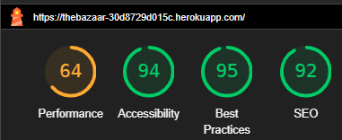

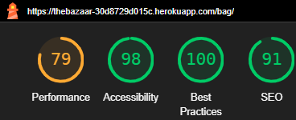
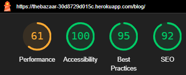
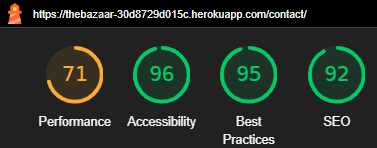
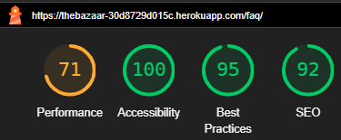
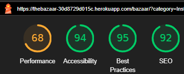

</details>

<details>
<summary>Desktop Scores</summary>

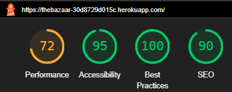
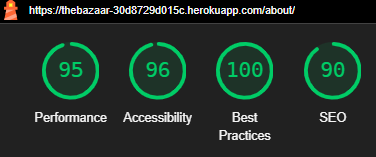
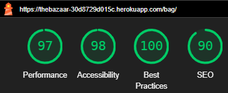
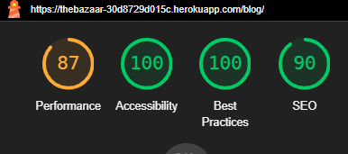

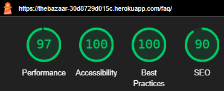
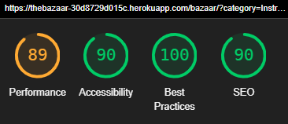

</details>

[Back to top ⇧](#table-of-contents)


---

## Bug Report

### Summary
I encountered a significant issue with Stripe webhooks that consumed an excessive amount of my time. It proved to be a challenging journey into the world of Stripe and webhooks. I made multiple attempts to resolve the problem, spending too much time tinkering with my checkout app, which deviated from my initial plans. Fortunately, the solution came swiftly once I decided to implement logging in the webhooks_handler.py file. This experience taught me the importance of proper logging and error handling. I've learned that often, the things I dislike the most are the most crucial. Therefore, I am committed to incorporating logging and robust error handling in all my future projects. I also recognize the need to improve my automated testing skills. The webhook's `payment_intent.succeeded` functionality was not working correctly due to a bag retrieval problem and missing import statement for the Stripe library.

### Design Issues
I encountered several design challenges along the way, with one notable instance being an attempt to rewrite the Bootstrap carousel's functionality. Unfortunately, this effort resulted in unexpected bugs, leading me to revert to the built-in carousel component. While I plan to work on this aspect in future development, for the current MVP, I decided to prioritize overall polish and functionality.

### Worst Setback
My most significant setback occurred with a voucher system I had developed, which malfunctioned in the database. My efforts to fix it nearly led to catastrophic damage to the entire database. As a result, I made the difficult decision to temporarily remove the voucher system from the project. I reasoned that, since I already had four custom models without it, the potential value it would add did not outweigh the risk of jeopardizing the project a week before the deadline. I intend to revisit and refine this feature in a future project when I have more time.

### Outstanding Issues
I have encountered issues related to Crispy Forms and Summernote errors while running the WAVE WCAG tool. Unfortunately, I have not yet identified a solution for these errors. Therefore, I will need to postpone addressing these issues until I have a viable solution.

### Other Bugs
Most of the remaining bugs I've encountered have been related to CSS or HTML design flaws. These issues often involve missed details or incorrect formatting. For instance, I encountered some formatting issues during the review process, but I was able to resolve them by revising the HTML code.

[Back to top ⇧](#table-of-contents)
